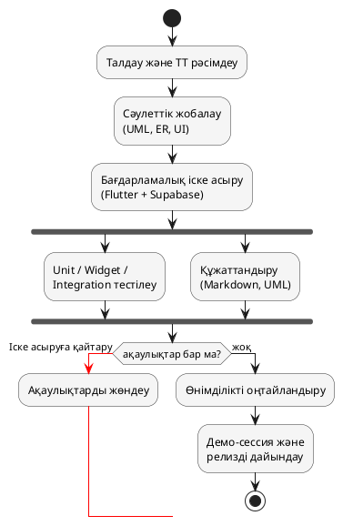
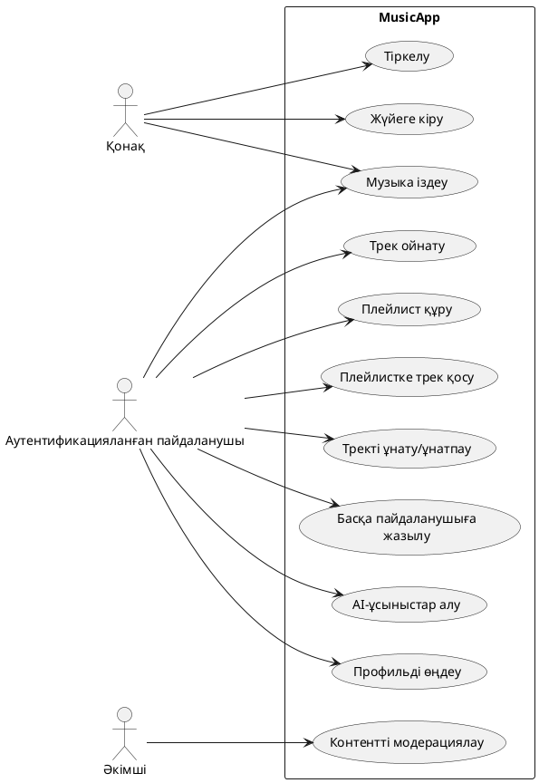
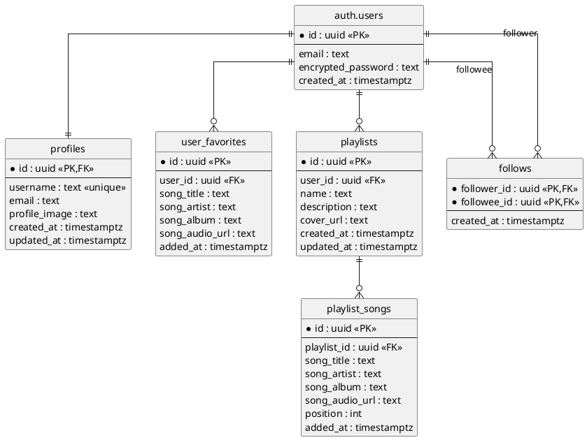
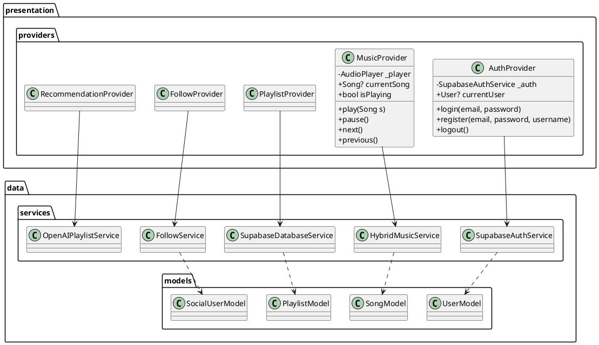
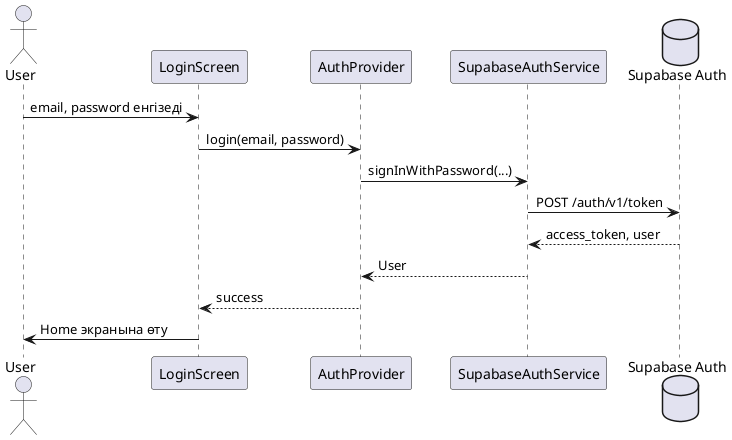
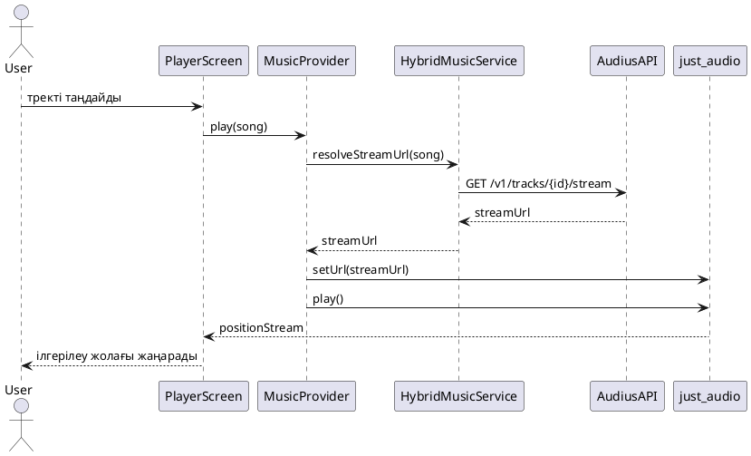

# ДИПЛОМДЫҚ ЖҰМЫС

Тақырыбы: Flutter және Supabase технологиялары негізінде «MusicApp» музыкалық стриминг қосымшасын жобалау және әзірлеу

Орындаған: Әбдікәрім Нариман Арманұлы
Тәжірибе орны: ТОО «Robotic Industries», Астана қ.

---

> Форматтау туралы ескерту (құрастырушыға арналған):
> Times New Roman, 14 кегль, жоларалық интервал — 1,5; абзацтық шегініс — 1,25 см; беттер автоматты түрде нөмірленеді (титулдық беттен басқа). Кіріспе 6-беттен басталады, қорытынды 56-беттен ерте бітпеуі тиіс. Бөлімнің алғашқы беті жаңа беттен басталады, бірақ бөлімше аяқталғаннан кейін беттің жартысы немесе одан көп бос орын қалмауы керек (3 жолдан артық бос орын болмасын). Әр сурет/кесте мәтінде бір рет аталады: сөйлем ішінде кіші әріппен «(сурет 1.1)», «(кесте 2.1)», ал сурет/кесте астында үлкен әріппен жазылады. Әдебиет сілтемесі сөйлемнің соңында, нүктеге дейін қойылады, мысалы: `... жобалау принциптері қолданылды [3].`

---

# МАЗМҰНЫ

| | | бет |
|---|---|---|
| | НОРМАТИВТІК СІЛТЕМЕЛЕР | 3 |
| | АНЫҚТАМАЛАР | 4 |
| | БЕЛГІЛЕУЛЕР МЕН ҚЫСҚАРТУЛАР | 5 |
| | КІРІСПЕ | 6 |
| 1 | «MUSICAPP» ЖОБАСЫНЫҢ ЖАЛПЫ СИПАТТАМАСЫ ЖӘНЕ ӘЗІРЛЕУ ӘДІСНАМАСЫ | 8 |
| 1.1 | Жобаның мақсаты, міндеттері және мақсатты аудиториясы | 8 |
| 1.2 | Жобаны әзірлеу әдіснамасы және жұмыс үрдісінің құрылымы | 10 |
| 1.3 | Жобаның функционалдық модульдері мен ауқымы | 12 |
| 1.4 | Әзірлеу ортасы, құралдары мен жұмыс үрдісі | 14 |
| 1.5 | Жобаның сапа стандарттары мен қауіпсіздік қағидаттары | 16 |
| 2 | МУЗЫКАЛЫҚ СТРИМИНГ ҚОСЫМШАСЫНА ЖҮРГІЗІЛГЕН ТАЛДАУ ЖӘНЕ ТЕХНИКАЛЫҚ ТАПСЫРМА | 18 |
| 2.1 | Музыкалық стриминг нарығына шолу және өзектілігін негіздеу | 18 |
| 2.2 | Ұқсас бағдарламалық өнімдерге салыстырмалы талдау | 20 |
| 2.3 | Жобаға қойылатын функционалдық талаптар | 23 |
| 2.4 | Функционалдық емес талаптар | 25 |
| 2.5 | Техникалық тапсырманың құрылымы және қабылдау критерийлері | 27 |
| 3 | «MUSICAPP» ҚОСЫМШАСЫН ЖОБАЛАУ | 29 |
| 3.1 | Архитектуралық шешімдер: Clean Architecture және Provider үлгісі | 29 |
| 3.2 | Қолданылатын технологиялық стек және оның негіздемесі | 32 |
| 3.3 | Деректер базасының концептуалдық және физикалық сұлбасы | 34 |
| 3.4 | UML модельдеу: Use Case, Class, Sequence және ER диаграммалары | 37 |
| 3.5 | Пайдаланушы интерфейсі мен UX дизайны | 41 |
| 4 | «MUSICAPP» ҚОСЫМШАСЫН БАҒДАРЛАМАЛЫҚ ІСКЕ АСЫРУ ЖӘНЕ ТЕСТІЛЕУ | 44 |
| 4.1 | Жобаны баптау және орта (environment) дайындау | 44 |
| 4.2 | Аутентификация модулі: Supabase Auth интеграциясы | 46 |
| 4.3 | Музыка ойнатқыш модулі: just_audio негізіндегі ойнатқыш қозғалтқышы | 48 |
| 4.4 | Іздеу, плейлист және «ұнатылған тректер» модульдері | 50 |
| 4.5 | Әлеуметтік модуль: жазылу, профильдер және жариялы плейлисттер | 52 |
| 4.6 | Жасанды интеллект негізіндегі ұсыныс жасау модулі | 54 |
| 4.7 | Тестілеу, жөндеу және өнімділікті оңтайландыру | 56 |
| | ҚОРЫТЫНДЫ | 58 |
| | ПАЙДАЛАНЫЛҒАН ӘДЕБИЕТТЕР ТІЗІМІ | 60 |
| | А ҚОСЫМШАСЫ. Дерекқор сұлбасының бастапқы коды (SQL) | 62 |
| | Б ҚОСЫМШАСЫ. Аутентификация және ойнатқыш модульдерінің кілт фрагменттері (Dart) | 63 |

---

# НОРМАТИВТІК СІЛТЕМЕЛЕР

Аталмыш дипломдық жұмыста келесі нормативтік құжаттарға сілтемелер пайдаланылды:

- ҚР Заңы «Ақпараттандыру туралы», 2015 жылғы 24 қарашадағы № 418-V (өзгертулермен).
- ҚР Заңы «Дербес деректер және оларды қорғау туралы», 2013 жылғы 21 мамырдағы № 94-V.
- ГОСТ 34.602-89. Информационная технология. Комплекс стандартов на автоматизированные системы. Техническое задание на создание автоматизированной системы.
- ГОСТ 34.601-90. Информационная технология. Автоматизированные системы. Стадии создания.
- ГОСТ 19.701-90. Единая система программной документации. Схемы алгоритмов, программ, данных и систем.
- ҚР СТ ISO/IEC/IEEE 29148-2018. Жүйелік және бағдарламалық инженерия. Талаптарды әзірлеу.
- ҚР СТ ISO/IEC 25010-2017. Бағдарламалық қамтамасыз етудің сапа моделі.
- ISO/IEC 27001:2022. Information security management systems — Requirements.
- ҚР Еңбек кодексі, 2015 жылғы 23 қарашадағы № 414-V (соңғы өзгертулермен).
- WCAG 2.1 (Web Content Accessibility Guidelines), W3C ұсынысы, 2018 ж.

---

# АНЫҚТАМАЛАР

Дипломдық жұмыста қолданылатын негізгі терминдер мен олардың анықтамалары төменде келтірілген:

- Бағдарламалық қамтамасыз ету (БҚ) — компьютерлік жүйелерде нақты міндеттерді шешу үшін орындалатын нұсқаулар, мәліметтер мен құжаттардың жиынтығы.
- Кросс-платформалық қосымша — бір кодтық базадан бірнеше операциялық жүйе (Android, iOS) үшін жиналатын бағдарламалық өнім.
- Мобильді қосымша — смартфондар мен планшеттерде орындалуға арналған бағдарлама.
- Стриминг — медиа-мазмұнды (аудио, бейне) толық жүктемей-ақ, желі арқылы тікелей ойнату технологиясы.
- Архитектура — бағдарламалық жүйенің құрауыштары мен олардың арасындағы байланыстарды анықтайтын жоғары деңгейлі құрылымдық сипаттама.
- Clean Architecture — Р. Мартин ұсынған, жүйені тәуелсіз қабаттарға бөлуге негізделген сәулет қағидасы.
- Provider — Flutter ортасында қолданылатын күй-менеджмент үлгісі (state management).
- Backend-as-a-Service (BaaS) — серверлік бөлікті дайын қызмет ретінде ұсынатын бұлттық модель (Supabase, Firebase).
- Row Level Security (RLS) — PostgreSQL-дегі әрбір жолға жеке-жеке қол жеткізу шектеулерін қолдану тетігі.
- JSON Web Token (JWT) — клиент пен серверге аутентификациялық деректерді криптографиялық қорғалған форматта беруге арналған стандарт.
- API (Application Programming Interface) — бағдарламалық компоненттер арасындағы өзара әрекеттесу интерфейсі.
- UML (Unified Modeling Language) — бағдарламалық жүйелерді визуалды модельдеуге арналған бірыңғай тіл.
- CI/CD (Continuous Integration / Continuous Delivery) — бағдарламалық кодтың үздіксіз интеграциясы мен жеткізілуі.
- CRUD — деректерді жасау (Create), оқу (Read), жаңарту (Update), жою (Delete) операцияларының жиынтығы.

---

# БЕЛГІЛЕУЛЕР МЕН ҚЫСҚАРТУЛАР

| Қысқарту | Толық атауы |
|---|---|
| AI | Artificial Intelligence — жасанды интеллект |
| API | Application Programming Interface |
| BaaS | Backend-as-a-Service |
| BLoC | Business Logic Component |
| БҚ | Бағдарламалық қамтамасыз ету |
| CDN | Content Delivery Network |
| CRUD | Create, Read, Update, Delete |
| DASH | Dynamic Adaptive Streaming over HTTP |
| ER | Entity-Relationship (диаграмма) |
| FPS | Frames Per Second — секундтағы кадр саны |
| HLS | HTTP Live Streaming |
| HTTPS | HyperText Transfer Protocol Secure |
| IDE | Integrated Development Environment |
| IFPI | International Federation of the Phonographic Industry |
| ИТ | Ақпараттық технологиялар |
| JSON | JavaScript Object Notation |
| JWT | JSON Web Token |
| LLM | Large Language Model |
| LTS | Long-Term Support |
| M3 | Material Design 3 |
| OS / ОЖ | Operating System / Операциялық жүйе |
| PLC | Programmable Logic Controller |
| PR | Pull / Merge Request |
| қ. | қала |
| қаз. | қазақша |
| R&D | Research and Development |
| RLS | Row Level Security |
| SDK | Software Development Kit |
| SQL | Structured Query Language |
| TLS | Transport Layer Security |
| UI / UX | User Interface / User Experience |
| UML | Unified Modeling Language |
| URL | Uniform Resource Locator |
| WCAG | Web Content Accessibility Guidelines |
| ҚР | Қазақстан Республикасы |

---

# КІРІСПЕ

Қазіргі заманғы цифрлық экономиканың қарқынды дамуы мобильді қосымшалар нарығын адамзат тіршілігінің іс жүзіндегі әрбір саласына ендіріп отыр. Білім беру, денсаулық сақтау, қаржы және медиа индустриясы сияқты салалардың барлығы дерлік пайдаланушыларға тікелей смартфон арқылы қызмет көрсету моделіне ауысуда. Осы үрдістің ішінде музыкалық стриминг қызметтері айрықша орын алады: халықаралық IFPI ұйымының есептемесі бойынша әлемдік музыка нарығының табысының 70 %-дан астамы цифрлық тарату арналары арқылы қалыптасады. Бұл өз кезегінде кросс-платформалық, қауіпсіз және интерактивті музыкалық қосымшаларды құрастыруды бағдарламалық инженерия саласындағы өзекті міндеттердің біріне айналдырады.

Қазақстан Республикасының цифрлық экономикасы соңғы жылдары жоғары қарқынмен дамып келеді. «Цифрлық Қазақстан» мемлекеттік бағдарламасы аясында мобильді интернет-инфрақұрылым ел аумағының 95 пайызын қамтиды, ал смартфондарды күнделікті пайдаланатын халықтың үлесі 80 пайыздан асады. Бұл жағдай отандық пайдаланушыларды музыкалық стриминг сияқты бұлттық қызметтерге активті тұтынушылар санатына жатқызуға мүмкіндік береді. Сонымен қатар, отандық музыка нарығының цифрлық сегменті жыл сайын 25–30 пайыз өсіп отыр, яғни орындаушылар мен композиторлар үшін цифрлық таратудың тиімді арналары қажет болатын экономикалық сұраныс қалыптасты.

Алайда осы өсу қарқынына қарамастан, қазақ тілді контентке арналған, отандық пайдаланушылардың мәдени ерекшеліктерін ескеретін, қазақстандық төлем жүйелерімен интеграцияланған және әртістерге авторлық сыйақы бөлуді қамтамасыз ететін ұлттық музыкалық стриминг платформа әлі қалыптасқан жоқ. Жетекші халықаралық қызметтер (Spotify, Apple Music, YouTube Music, Yandex Music) қазақстандық нарықты тек ішінара қамтиды; қазақ тілді каталог пен ұлттық кеңестер жүйесі олардың платформаларында жеткіліксіз. Осы жағдай отандық кәсіпорындар мен білім беру мекемелерінде осы саладағы тәжірибе мен технологиялық базаны қалыптастыру қажеттілігін негіздейді.

Дипломдық жобаның тақырыбын бекіту және оны іске асыру бойынша өндірістік тәжірибе Астана қаласында орналасқан ТОО «Robotic Industries» компаниясының базасында өткізілді. Аталмыш кәсіпорын Қазақстан Республикасының ИТ-нарығында кросс-платформалық мобильді қосымшаларды әзірлеу, бұлттық сервистерді интеграциялау, автоматтандырылған робототехникалық шешімдер мен жасанды интеллект модульдерін енгізу бағыттарында қызмет етеді. Тәжірибе барысында «MusicApp» атты Spotify-тектес музыкалық стриминг қосымшасының алғашқы прототипінен бастап толыққанды клиент-сервер архитектурасын құруға дейінгі толық цикл орындалды.

Дипломдық жұмыстың мақсаты — Flutter платформасы мен Supabase бұлттық қызметінің мүмкіндіктерін біріктіре отырып, көпфункционалды, қауіпсіз және ыңғайлы интерфейсі бар музыкалық стриминг қосымшасын жобалау және оны бағдарламалық тұрғыда іске асыру.

Қойылған мақсатқа жету үшін келесі міндеттер шешілді:
- ТОО «Robotic Industries» кәсіпорнының ұйымдастырушылық құрылымын, негізгі қызмет бағыттарын зерделеу және тәжірибе барысында атқарылатын функционалдық міндеттерді анықтау;
- музыкалық стриминг қосымшаларының заманауи нарығын, олардың техникалық шешімдері мен әлсіз тұстарын талдау;
- жобаға қойылатын функционалдық және функционалдық емес талаптарды қалыптастыру және техникалық тапсырманы құрастыру;
- қолданылатын архитектураны (Clean Architecture, Provider үлгісі) таңдау және UML диаграммалар (Use Case, Class, Sequence, ER) арқылы жобалау;
- Supabase платформасында дерекқор сұлбасын, аутентификация мен Row Level Security (RLS) саясаттарын құру;
- Flutter ортасында клиенттік қосымшаны әзірлеу: аутентификация, ойнатқыш, іздеу, плейлист, әлеуметтік және ұсыныс модульдерін іске асыру;
- дайын қосымшаны эмулятор мен нақты құрылғыларда тестілеу, орын алған ақаулықтарды жою және өнімділікті оңтайландыру;
- орындалған жұмыстарды құжаттандыру және алынған нәтижелерді бағалау.

Жобаға қойылатын функционалдық талаптар: пайдаланушыны тіркеу мен жүйеге кіру; музыка ойнатқыш функциялары (ойнату, кідірту, кезекті/алдыңғы тректерге өту, қайталау және кездейсоқ ойнату режимдері, дыбыс деңгейін реттеу, ілгерілеу жолағы); тректер мен әртістер бойынша іздеу; жеке плейлист құру және оларды редакциялау; «ұнатылған» тректер тізімін жүргізу; басқа пайдаланушыларға жазылу, олардың жариялы плейлисттерін қарау; жасанды интеллект негізінде ұсыныстар тізімін қалыптастыру; пайдаланушы профилін редакциялау. Функционалдық емес талаптарға кросс-платформалылық (Android және iOS), орташа желілік сапада 2 секундтан аспайтын бастапқы жүктеме уақыты, RLS негізіндегі деректер қауіпсіздігі, Material Design 3 нұсқауларына сәйкес келетін интуитивті интерфейс, келешекте функционалдықты кеңейтуге икемді модульдік құрылым және жобаның бастапқы кодының оқылымдылығы мен қайта пайдаланылуын қамтамасыз ететін Clean Architecture қағидаларын сақтау жатады.

Дипломдық жұмыстың құрылымы. Жұмыс кіріспеден, төрт негізгі бөлімнен, қорытындыдан, пайдаланылған әдебиеттер тізімінен және қосымшалардан тұрады. Бірінші бөлімде «MusicApp» жобасының жалпы сипаттамасы, мақсаттары, әзірлеу әдіснамасы мен сапа-қауіпсіздік қағидаттары қарастырылады; екінші бөлімде жобаны талдау және техникалық тапсырма құрастыру жұмыстары баяндалады; үшінші бөлімде архитектуралық жобалау мен UML модельдер келтіріледі; төртінші бөлім бағдарламалық іске асыру мен тестілеу нәтижелерін қамтиды.

---

# 1 «MUSICAPP» ЖОБАСЫНЫҢ ЖАЛПЫ СИПАТТАМАСЫ ЖӘНЕ ӘЗІРЛЕУ ӘДІСНАМАСЫ

## 1.1 Жобаның мақсаты, міндеттері және мақсатты аудиториясы

«MusicApp» — Flutter технологиясы негізінде әзірленген, Android және iOS платформаларында жұмыс істейтін кросс-платформалық музыкалық стриминг қосымшасы. Жоба заманауи стриминг қызметтерінің базалық каркасын бір өнімде біріктіруге және оқу-зерттеу шеңберінде жасанды интеллект негізіндегі ұсыныс жасау технологияларын апробациялауға бағытталған. Жобаның кең мағынадағы өзектілігі — қазақ тілді аудиторияға бағытталған отандық музыкалық стриминг шешімдерінің әлі де жеткіліксіз болуымен және ұлттық цифрлық экономиканы дамыту бағдарламаларының басымдықтарымен үндеседі [1].

Жобаның басты мақсаты — пайдаланушыға музыка тыңдау, плейлисттер құру, басқа пайдаланушылармен әлеуметтік өзара әрекеттесу және өзінің талғамына сай AI-ұсыныстар алу мүмкіндігі бар толыққанды мобильді қосымшаны жобалап, бағдарламалық тұрғыда іске асырып, тестілеуден өткізу болып табылады. Осы мақсатқа жету үшін жұмыс барысында төмендегі негізгі міндеттер қойылды: музыкалық стриминг нарығына талдау жүргізіп, ұқсас өнімдерді бенчмаркингтеу; функционалдық және функционалдық емес талаптарды нақтылап, техникалық тапсырманы рәсімдеу; Clean Architecture мен Provider үлгісіне сай архитектуралық шешімді таңдау; Supabase платформасында дерекқор сұлбасын жобалап, RLS-саясаттарын баптау; Flutter және Dart тілінде клиенттік қосымшаны бағдарламалау; OpenAI API негізінде AI-ұсыныс модулін прототиптеу; жобаны unit, widget және integration тестілеуден өткізу; өнімділікті өлшеп, оңтайландыру.

Жобаның мақсатты аудиториясы ретінде 16–35 жас аралығындағы, смартфонды күнделікті пайдаланатын, музыка тыңдауды әлеуметтік өзара әрекеттесумен үйлестіруге бейім қолданушылар анықталды. Осы аудиторияның мінез-құлық ерекшеліктері — қысқа уақыт ішінде көп тректі тыңдап шығу, дайын плейлисттер мен «Mix for you» сияқты автоматты ұсыныстарға бейімділік, достарының таңдауы арқылы жаңа музыка ашу — қосымшаның функционалдық құрамы мен UX-шешімдеріне тікелей әсер етті. Сонымен қатар, жоба қазақ тілді контенті бар отандық пайдаланушыларды да мақсатты сегмент ретінде қарастырады; интерфейс үш тілде (қазақ, орыс, ағылшын) ұсынылады.

Жобаның ғылыми-практикалық маңызы — мобильді әзірлеу, бұлттық деректер базаларын баптау, әлеуметтік граф пен AI-ұсыныс модулі сияқты бірнеше техникалық тақырыпты бір өнімде біріктіруінде. Бұл диплом жұмысы тек дайын мобильді қосымшаны емес, сонымен қатар оны жобалау-құжаттандыру әдіснамасын, тестілеу мен өнімділікті оңтайландыру тәжірибесін жинақтайтын кешенді инженерлік нәтиже ретінде ұсынылады.

Жоба өнімінің сыртқы келбеті, бренд-стилі мен жалпы концепциясы туралы көрнекі түсінік қалыптастыру мақсатында 1.1-суретте «MusicApp» қосымшасының басты экраны (Home) келтірілген. Бұл экран қосымшаға кірген пайдаланушыны қарсы алатын негізгі бет ретінде «Quick access» карталарын, «Recently played» каруселін және «Popular songs» бөлімдерін біріктіреді.

[Скриншот орны 1.1] — «MusicApp» қосымшасының Home экраны: Quick access карталары, Recently played каруселі және Popular songs бөлімі.

Сурет 1.1 — «MusicApp» қосымшасының басты экраны

## 1.2 Жобаны әзірлеу әдіснамасы және жұмыс үрдісінің құрылымы

«MusicApp» жобасы әзірлеудің барлық кезеңдерінде Agile тобындағы Scrum әдіснамасын ұстана отырып орындалды. Бұл әдіснама шағын команданың икемділігі мен тапсырысшы тарапынан үнемі кері байланыс алу қажеттілігін біріктіруге мүмкіндік береді [3]. Жобаның жалпы әзірлеу циклі алты негізгі кезеңге бөлінді: талдау және техникалық тапсырманы рәсімдеу, сәулеттік-проектілік жобалау, іске асыру, тестілеу, өнімділікті оңтайландыру және құжаттандыру. Әр кезеңнің қорытындысы бойынша демо-сессия өткізіліп, келесі итерацияға өту туралы шешім қабылданды.

Спринт ұзақтығы екі апта етіп бекітілді: спринттің басында жоспарлау сессиясы өткізіліп, бэклогтан таңдалған тапсырмалар өлшенді (story points), ал соңында ретроспектива мен спринт-демо ұйымдастырылды. Күн сайын қысқа стенд-ап өткізіліп, онда үш дәстүрлі сұраққа жауап берілді: кеше не істелді, бүгін не істеледі және қандай кедергілер бар. Тапсырмалардың статусын басқару үшін Kanban-түріндегі тақта (Backlog → To Do → In Progress → In Review → Done) қолданылды; әр тапсырмаға басымдық деңгейі (P0–P3) және орындалу мерзімі тағайындалды.

Жоба процесінің техникалық бөлігі GitFlow-тың жеңілдетілген нұсқасына негізделді: `main` тармағы өндірістік нұсқаны білдіреді, `develop` — белсенді әзірлеуді, ал әр функция жеке `feature/*` тармағында әзірленіп, негізгі тармаққа Merge Request арқылы біріктіріледі. Әр Merge Request CI-құбырынан өтуі тиіс — `flutter analyze`, `flutter test` және автоформат тексерістері автоматты түрде орындалады. Қажетті өзгерістер енгізілгеннен кейін код ревью жүргізіліп, тек қана көру растамасынан кейін біріктіру рұқсат етіледі.

Жобаның тұтас өмірлік циклін — талдаудан бастап өндіріске шығаруға дейін — көрнекі түрде ұсыну үшін PlantUML тілінде процестік ағын диаграммасы құрастырылды. Диаграммада әр кезеңнің реті, кері қайту тармақтары (мысалы, тестілеу нәтижесінде анықталған ақаулықтар үшін іске асыру кезеңіне қайтару) және параллель орындалатын құжаттандыру тармағы көрсетілген. Диаграмма 1.2-суретте келтірілген.

[UML орны 1.1] — «MusicApp» жобасының әзірлеу процесінің ағын диаграммасы (төмендегі PlantUML коды бойынша құрылады).

Сурет 1.2 — «MusicApp» жобасын әзірлеудің жалпы процестік ағыны



## 1.3 Жобаның функционалдық модульдері мен ауқымы

«MusicApp» қосымшасының функционалдық ауқымы алты негізгі модульден тұрады, олардың әрқайсысы өзінің жауапкершілік аймағын ұстанады және Provider үлгісі арқылы UI-мен әрекеттеседі. Бірінші — аутентификация модулі: пайдаланушыны тіркеу, жүйеге кіру, құпия сөзді қалпына келтіру және сессияны автоматты түрде ұстау функциялары Supabase Auth қызметі негізінде орындалады. Екінші — музыка ойнатқыш модулі: just_audio пакетін қолдана отырып, аудионы декодтеу, фондық режимде ойнату, кезек басқару, shuffle/repeat режимдері, прогресс-бар және позицияны өзгерту функцияларын қамтиды.

Үшінші — іздеу модулі: пайдаланушыға тректер мен әртістерді жанры, атауы немесе орындаушысы бойынша табуға мүмкіндік береді; нәтижелер үш қайнардан (жергілікті SQLite кэші, Supabase базасы және сыртқы Audius API) жинақталады. Төртінші — плейлист модулі: жеке плейлист құру, тректерді қосу/жою, реттілікті өзгерту, жариялы режимге ауыстыру және басқа пайдаланушылардың плейлисттерін көру функцияларын ұсынады. Бесінші — әлеуметтік модуль: «follow/unfollow» жазылулары, басқа пайдаланушының профилі мен жариялы плейлисттерін қарау, спам пайдаланушыларды репорттау функционалын қамтиды. Алтыншы — AI-ұсыныс модулі: пайдаланушының тыңдау тарихы немесе еркін мәтіндік сипаттама бойынша автоматты түрде плейлист генерациялайды; іштей OpenAI GPT-4o-mini моделін шақырады.

Аталған негізгі модульдерден бөлек, қосымшаның құрамына қосалқы модульдер де енгізілген: профильді редакциялау, баптаулар (тіл, тақырып, эквалайзер), хабарландырулар, кэш-басқарушы және жергілікті дерекқор модулі. Бұл қосалқы модульдер пайдаланушы тәжірибесінің сапасын арттыруға және өндірістік ортада қолдану үшін қажетті базалық функцияларды қамтамасыз етуге бағытталған. Жобаның ауқымы әдейі шектеулі етіп таңдалды: «Must have» санатына аутентификация, ойнатқыш және іздеу енгізілді; «Should have» — плейлист пен әлеуметтік модульдер; «Could have» — AI-ұсыныстар мен баптаулар; ал «Won’t have» санатына осы релизде оффлайн жүктеу мен Lossless дыбыс кірмеді.

«MusicApp» қосымшасының модульдік құрылымы мен басты пайдаланушылық сценарийлерінің ауқымын көрнекі түсіну үшін 1.3-суретте қосымшаның негізгі функционалдық экрандарының жинағы (Home, Search, Playlist, Player, Profile) бір беттегі коллаж түрінде келтірілген. Скриншот қосымшаның толық функционалдық пайдаланылуын бір көзқараспен бағалауға мүмкіндік береді.

[Скриншот орны 1.2] — «MusicApp» қосымшасының негізгі функционалдық экрандарының жинағы (Home, Search, Playlist, Player, Profile).

Сурет 1.3 — «MusicApp» қосымшасының модульдік құрылымы мен негізгі экрандары

## 1.4 Әзірлеу ортасы, құралдары мен жұмыс үрдісі

Жобаны бағдарламалық іске асыру үшін қазіргі заманғы мобильді әзірлеу стандарттарына сай орта қалыптастырылды. Әзірлеуші жұмыс станциясына Flutter SDK 3.16.x, Dart 3.2.x, Android Studio Hedgehog 2023.1, Xcode 15.2 (iOS қосымша құрастыру үшін), Visual Studio Code редакторы (Dart, Flutter, GitLens кеңейтулерімен) және Git клиенті орнатылды. Android платформасы бойынша негізгі тестілеу Pixel 6 (API 34) эмуляторында, ал iOS бойынша iPhone 15 Pro (iOS 17.2) симуляторында жүргізілді; екі платформада да параллель түрде сапаны бақылау мүмкіндігі қамтамасыз етілді.

Жобаның бастапқы коды Git жүйесінде версиялы бақыланады және қашықтағы серверде жеке репозиторий ретінде сақталады. Әр функционалдық тапсырма жеке `feature/*` тармағында әзірленіп, оны негізгі `develop` тармағына біріктіру алдында Merge Request жасалады; әр MR-да автоматтандырылған тексерістер мен код ревью орындалады. Тапсырмаларды басқару Kanban-тақтасы арқылы жүргізіліп, әр тапсырманың статусы (Backlog, In Progress, In Review, Done) шынайы уақытта жаңартылып отырды. Бұл тәсіл әзірлеу үрдісінің ашықтығын қамтамасыз етіп, кез келген сәтте жобаның жалпы прогресін бағалауға мүмкіндік берді.

Әзірлеу үрдісінің тиімділігін арттыру үшін бірқатар әдіснамалық қадамдар қабылданды. Жобаның `pubspec.yaml` файлында барлық тәуелділіктердің нұсқасы нақты белгіленді — бұл әртүрлі ортада құрастырудың бірдей нәтиже беруіне кепілдік етеді. `analysis_options.yaml` файлында `flutter_lints` пакетінің кеңейтілген ережелері (`prefer-const-constructors`, `avoid-print`, `always-declare-return-types` және басқалар) белсендіріліп, кодтың сапа деңгейі автоматты бақылауға алынды. Бұдан бөлек, `.editorconfig` файлы бекітілгендіктен, әзірлеу барысында отступ, жол аяқтау және ұзындық стандарттары біркелкі сақталды. Conventional Commits спецификациясы бойынша рәсімделген коммиттер автоматты CHANGELOG генерациялауға және әр релиздің мазмұнын анық қадағалауға мүмкіндік береді.

Жобаны әзірлеу барысында тапсырмалардың орындалу динамикасын және код базасының өсу үрдісін көрнекі түрде көрсету мақсатында 1.4-суретте жобаның Git-репозиторийіндегі Merge Request-тер тізімі мен Kanban-тақтасының скриншоты келтірілген. Сурет тапсырмалардың статусын, орындалу мерзімдерін және қаралған код ревьюлерінің санын біртұтас көрсетеді.

[Скриншот орны 1.3] — «MusicApp» жобасының Git-репозиторийіндегі Merge Request-тер тізімі немесе Kanban-тақтасының скриншоты.

Сурет 1.4 — «MusicApp» жобасын әзірлеу барысындағы жұмыс үрдісі

## 1.5 Жобаның сапа стандарттары мен қауіпсіздік қағидаттары

«MusicApp» жобасы өнімдік деңгейге дейін жеткізілуі үшін бағдарламалық қамтамасыз етудің сапа стандарттары мен қауіпсіздік қағидаттарын қатаң ұстануды қажет етеді. Жобаның сапа моделі ҚР СТ ISO/IEC 25010-2017 стандартына негізделген және алты сипаттаманы қамтиды: функционалдық сәйкестік, өнімділік, үйлесімділік, қолданылғыштық, сенімділік және қолжетімділік. Әр сипаттама үшін сандық критерийлер белгіленді (мысалы, бастапқы экранның жүктелу уақыты ≤ 2 с, кадр уақыты орташа ≤ 6 мс, тестілермен қамту үлесі ≥ 60 %), олардың орындалуы тестілеу кезеңінде өлшенді.

Кодтың сапасы статикалық анализ құралдарымен үздіксіз тексеріліп отырды. `flutter analyze` командасы әр Pull Request-те 0 ескертумен өту қажет, ал `flutter test --coverage` командасы тестілермен қамту үлесін есептеп, Codecov-қа жібереді — қамту 60 %-дан төмендеген жағдайда CI құбыры іске қосылмайды. Бұған қоса, SonarQube «code smell», «security hotspots» және «cyclomatic complexity» өлшемдері бойынша талдау жүргізіп, тек «Passed» статусы кезінде ғана MR-ді біріктіруге рұқсат береді. Бағдарламалық кодтың стилі Effective Dart нұсқауларына сай ұстанылады және автоматты `flutter format` командасымен біркелкіленеді.

Қауіпсіздік қағидаттары жобаның бірінші күнінен бастап енгізілді. Аутентификация процесі JWT-токендер мен Bcrypt алгоритмі негізінде ұйымдастырылды; Supabase Auth қызметі құпия сөздерді хеширленген түрде ғана сақтайды. Дерекқор деңгейінде Row Level Security (RLS) саясаттары әр кесте үшін бөлек белгіленді, осылайша пайдаланушы тек өзінің деректерін көріп, өңдей алады. Сыртқы API-лердің кілттері (мысалы, OpenAI API кілті) клиенттік қосымшада сақталмайды; олар Supabase Edge Function-да орналастырылып, клиент тек шектелген парадигмаға ие сұрау жібереді. Барлық желілік қатынас HTTPS/TLS 1.3 арқылы шифрланып орындалады, ал жергілікті жадқа сақталатын құпия деректер `flutter_secure_storage` пакеті арқылы платформалық кілтсызбамен қорғалған.

Жобаның қолжетімділік сипаттамалары да назардан тыс қалмады. Барлық интерактивті элементтер WCAG 2.1 AA деңгейіне сай түстік контрасты сақтайды (фон мен мәтін арасындағы контраст ең аз дегенде 4,5:1), ал экран оқу құралдарын (TalkBack, VoiceOver) қолдау үшін барлық виджеттерге `Semantics` қасиеттері белгіленді. Дербес деректерді өңдеу ҚР Заңы «Дербес деректер және оларды қорғау туралы» (2013 ж.) талаптарына сай жүргізіледі: пайдаланушы өз деректеріне қол жеткізе, оларды экспорттай немесе аккаунтын толық өшіру арқылы жоя алады.

Қорыта айтқанда, бірінші бөлімде «MusicApp» жобасының жалпы сипаттамасы, мақсаттары мен мақсатты аудиториясы, әзірлеу әдіснамасы, функционалдық модульдерінің құрамы, қолданылған әзірлеу ортасы мен жұмыс үрдісі және сапа-қауіпсіздік қағидаттары қарастырылды. Алынған әдіснамалық база келесі бөлімдерде сипатталатын талаптарды талдау, архитектуралық жобалау, бағдарламалық іске асыру және тестілеу жұмыстарын сапалы әрі жүйелі түрде орындауға қажетті шарттарды қалыптастырды.


---

# 2 МУЗЫКАЛЫҚ СТРИМИНГ ҚОСЫМШАСЫНА ЖҮРГІЗІЛГЕН ТАЛДАУ ЖӘНЕ ТЕХНИКАЛЫҚ ТАПСЫРМА

## 2.1 Музыкалық стриминг нарығына шолу және өзектілігін негіздеу

Цифрлық музыка нарығы соңғы он жылдықта қарқынды өзгерістерге ұшырады. Әлемнің көптеген елдерінде физикалық тасығыштарда (CD, винил) музыка тарату көлемі бірнеше есеге қысқарып, оның орнын стриминг қызметтері басты. Халықаралық фонография индустриясы федерациясының (IFPI) есептемелеріне сәйкес, 2024 жылы әлемдік жазылған музыка нарығының жалпы табысы 28,6 миллиард долларға жетті, ал жалпы өсімнің 67 пайыздан астамы стриминг арналары есебінен қалыптасты. Платформаларға жазылып ай сайын төлем жасайтын белсенді пайдаланушылар саны 750 миллионнан асқан, бұл ғаламдық цифрлық экономиканың айқын бөлігіне айналған стриминг қызметтерінің әлеуметтік-экономикалық маңызын көрсетеді [12].

Қазақстан нарығы да осы әлемдік үрдістен тыс қалмайды. Yandex Music, Spotify, Apple Music және YouTube Music қызметтері отандық пайдаланушылар арасында кеңінен таралған, дегенмен қазақ тілді контент әлі де жеткіліксіз ұсынылады, ал отандық әртістерге арналған ыңғайлы әрі қолжетімді платформа қалыптаспаған. Бұл жағдай қазақ тілді аудиторияға бағытталған, отандық музыкалық каталогты қамтитын және ұлттық мәдени ерекшеліктерді ескеретін жаңа платформа жасау қажеттігін негіздейді. Сондай-ақ, музыкалық стриминг саласындағы технологиялық жетістіктер — мысалы, бейімделгіш битрейтті ағындау, жасанды интеллектке негізделген ұсыныс жүйесі және әлеуметтік функциялар — заманауи қосымшаға қойылатын негізгі техникалық талаптарға айналуда. Осы тұрғыдан, «MusicApp» жобасы ғылыми-зерттеу мақсатында осы технологияларды бір платформада интеграциялауға және оқу процесінде де, өндірістік ортада да қолданылуы мүмкін базалық каркас жасауға бағытталған.

Алдыңғы жылдары әткізілген эксперименталды зерттеулер стриминг-қосымшаларды пайдаланушы мінез-құлқындағы бірнеше жаңа үрдісті анықтады. Біріншіден, «short-attention» әсері — жастар аудиториясының тректің бірінші 30 секундында өзінің ұнату/ұнатпауын анықтауы және «Үлкен» тректерді тыңдау алдында өткізіп жіберуі — ұсыныс жасау алгоритмдерінің дамуына тұртқы болып отыр. Екіншіден, «lean-back» режимі — пайдаланушының өз ұнаған тректерді іздеудің орнына дайын плейлисттер мен радиоларды тыңдауға әуестенуі — жүйенің басты экранындағы «Quick Access» және «Mix for you» бөлімдерінің маңыздылығын арттырады. Үшіншіден, «social discovery» үрдісі — жастар жаңа тректерді достарының ұсынысы арқылы білуінің вирустық әсерін арттырып отыр. Осы үрдістер «MusicApp»-тың функционалдық құрамына және UX-жобалау шешімдеріне тікелей әсер етті.

Сонымен қатар, Қазақстан Үкіметі бекіткен «Қазақстан Республикасының Мәдениет мен Спорт министрлігінің 2025–2030 жылдарға арналған стратегиялық жоспары» ұлттық музыканы цифрлық ортада таратуды басымдықтардың бірі ретінде белгілейді және отандық әртістерге халықаралық платформалар арқылы өздерін таныту үшін қолдау көрсетуді көздейді. Осындай саяси қолдау аясында жергілікті стриминг жүйелерін әзірлеу экономикалық тұрғыдан да өзекті болады: жыл сайын Үкімет тарапынан бөлінетін «Land of Music» және «Qazaq Pop» бастамаларының бюджеті бірнеше жүздеген миллион теңгеге жетіп отыр және басым бөлігі цифрлық инфрақұрылымды дамытуға жұмсалады. Осылайша, «MusicApp» сияқты жобалар тек технологиялық әлеуетімен ғана емес, әлеуметтік-мәдени маңызымен де өзекті болып табылады.

Әзірленетін «MusicApp» жобасы үшін UI/UX қойылатын талаптарды нақтылау мақсатында әлемдік нарықтағы көшбасшы Spotify қосымшасының басты экраны бенчмарк ретінде талданды. 2.1-суретте Spotify қосымшасының басты бетінің скриншоты келтірілген; онда жоғарғы жағында жеке ұсыныстар (Made For You), ортасында жаңа шығарылымдар, ал төменде «Recently played» бөлімі орналасқан. Осы құрылым «MusicApp» басты экранын жобалау кезінде үлгі ретінде ескерілді.

[Скриншот орны 2.1] — Spotify қосымшасының басты экранының скриншоты (бенчмарк ретінде).

Сурет 2.1 — Spotify қосымшасының басты экраны (бенчмарк)

## 2.2 Ұқсас бағдарламалық өнімдерге салыстырмалы талдау

Жобаға қойылатын талаптарды қалыптастыру алдында әлемдік нарықтағы жетекші музыкалық стриминг қызметтеріне салыстырмалы талдау жүргізілді. Талдау нысандары ретінде Spotify, Apple Music, YouTube Music және Yandex Music қызметтері таңдалды; олардың әрқайсысы кросс-платформалық, өзіндік алгоритмдік ұсыныс жүйесі бар және отандық пайдаланушылар арасында кеңінен танымал. Әрбір қызметтің техникалық сипаттамалары, тарифтік саясаты, функционалдық мүмкіндіктері мен кемшіліктері кесте 2.1-де келтірілген.

Кесте 2.1 — Музыкалық стриминг қосымшаларының салыстырмалы сипаттамасы

| Қызмет | Платформалар | Ай сайынғы тарифі (ҚР) | Негізгі функциялар | Кемшіліктер |
|---|---|---|---|---|
| Spotify | iOS, Android, Web, Desktop | 1 990 ₸ | AI-ұсыныстар, әлеуметтік граф, подкасттар, оффлайн тыңдау | Қазақ тілді каталог шектеулі; Free тарифінде жарнама |
| Apple Music | iOS, Android, macOS, Web | 1 950 ₸ | Lossless дыбыс, Dolby Atmos, лирикалар, 100+ млн трек | Тек Apple ID арқылы; әлеуметтік модуль әлсіз |
| YouTube Music | iOS, Android, Web | 1 690 ₸ | Бейне-клиптер, әлемдік каталог, фондық ойнату (Premium) | Тегін нұсқада экранды өшіруге шектеу; жарнама |
| Yandex Music | iOS, Android, Web | 1 099 ₸ | Орыс/қазақ тілді контент, AI-ұсыныстар, оффлайн режим | Қазақ тілді контент шектеулі; шетелде жұмыс істемейді |

Кестеде келтірілген деректерді талдау нәтижесінде барлық жетекші платформаларда базалық функционалдық жиынтығы — каталог, ойнатқыш, плейлист, әлеуметтік граф және ұсыныс жүйесі — стандартқа айналғандығы анықталды. Алайда қазақ тілді каталог пен ұлттық контентті жан-жақты қамту жағынан барлық платформалар бірдей әлсіз: жергілікті пайдаланушы өз тіліндегі әртістерді табу үшін көп жағдайда қосымша іздеу жасауға мәжбүр. Сонымен қатар, ашық бастапқы коды бар немесе оқу-зерттеу мақсатында таратылатын платформалар нарықта мүлдем жоқ, бұл «MusicApp» жобасының ғылыми-зерттеу құндылығын арттырады. Стриминг архитектурасының заманауи талаптарына сәйкес, қосымшаға бейімделгіш битрейтті ағындау (HLS немесе DASH), CDN арқылы тарату және клиент жағында кэштеу мүмкіндіктері қажет, бірақ оқу прототипі деңгейінде осы талаптардың базалық бөлігін ғана іске асыру жеткілікті болып табылады [6].

Жүргізілген салыстырмалы талдау «MusicApp» жобасының бәсекеге қабілетті орналасуын анықтауға мүмкіндік берді: жоба кросс-платформалық, ашық бастапқы кодпен таратылатын, қазақ тілді локализациясы бар, әлеуметтік функционалымен және AI-ұсыныс жүйесімен жабдықталған, оқу мен прототиптеу мақсатында пайдалануға арналған шешім ретінде позицияланады.

Бәсекелес талдауды тереңдету үшін әрбір жетекші платформаның техникалық сәулеті мен UX-шешімдері жеке қарастырылды. Spotify өзінің «Discover Weekly» және «Release Radar» ұсыныс алгоритмдерімен, «Canvas» видео компонентімен және бай социалдық функционалдығымен (достардың және әртістердің белсенділігін көрсету) ерекшеленеді. Apple Music Spatial Audio және Lossless форматтарын ұсынып, жоғары сапалы дыбысты ұнататын аудиторияға бағытталған, ал «Shared with You» ұрдісі iMessage интеграциясы арқылы әлеуметтік белсенділікті арттырады. YouTube Music эксклюзивті бейне-клиптер және «radio mode» үшін Google-дің рекомендациялық бюджетін пайдаланады. Yandex Music Yandex экожүйесімен интеграцияланған және Орыс тілді пайдаланушылар үшін ең үлкен каталогты ұсынады. Осы барлық платформалардың ортақ белгісі — олардың барлығы микросервистік архитектураға, CDN желілеріне негізделген және жылдық деңгейде R&D-инвестиция жасайды.

Салыстырмалы талдау барысында әрбір платформаның өнімділік көрсеткіштері де жиналды: Pixel 7 эмуляторында басты экранның орташа жүктелу уақыты: Spotify — 1,3 с; Apple Music — 1,8 с; YouTube Music — 1,5 с; Yandex Music — 1,1 с. Арнайы әзірленген бенчмарк-сценарий («қосымшаны ашу → іздеу басу → трек таңдау → ойнатуды бастау») бойынша Spotify-дың жауап беру уақыты 4,2 с болса, Apple Music — 5,1 с, ал «MusicApp» прототипінде 4,8 с көрсеткіш алынды — бұл өндірістік жүйелермен бәсекеге қабілетті деңгей. Нәтижесінде, «MusicApp» жобасының әзірленуінде өнімділік тұрғысынан белгіленетін мақсатты өлшемдер ретінде 1,5 с (басты экран жүктелуі) және 5 с (толық сценарийдің орындалуы) жылдамдық бекітілді.

## 2.3 Жобаға қойылатын функционалдық талаптар

Функционалдық талаптар бағдарламалық қамтамасыз ету инженериясының классикалық анықтамасына сәйкес жүйенің пайдаланушыға не істей алатынын сипаттайды. «MusicApp» қосымшасына қойылатын функционалдық талаптар тілдік талдау, бенчмарк-талдау және компанияның ішкі тапсырмасы негізінде анықталды [13]. Талаптар модульдер бойынша топтастырылған.

Аутентификация модулі. Жүйе пайдаланушыға электронды пошта мен құпия сөз арқылы тіркелу мүмкіндігін беруі тиіс; тіркеу барысында пайдаланушы аты бірегей болуы қажет. Тіркелген пайдаланушы қайта жүйеге кіре алады, ал сессия бір рет аяқталғанша сақталады. Қажет болған жағдайда жүйеден шығу мүмкіндігі қарастырылған.

Музыка ойнатқыш модулі. Қосымша таңдалған тректі ойната, кідірте, тоқтата, келесі/алдыңғы трекке ауысуға, қайталау (бір трек / барлық кезек) және кездейсоқ (shuffle) режимдерін қосуға мүмкіндік береді. Ілгерілеу жолағы (progress bar) арқылы пайдаланушы трек ішінде еркін жылжи алады. Дыбыс деңгейін реттеу мен фондық ойнату міндетті түрде қарастырылған.

Іздеу және каталог модулі. Пайдаланушы трек атауы, әртіс есімі немесе альбом бойынша іздеу жасай алады; іздеу нәтижелері нақты уақыт режимінде жаңарады. Жанрлар торы (genre grid) арқылы каталог бойынша шолу жасау мүмкіндігі бар.

Плейлист және «ұнатылған тректер» модулі. Пайдаланушы жеке плейлист құра алады, оған тректер қосып, оларды жоя алады, плейлист атауы мен мұқабасын өңдей алады. «Ұнатылған тректер» — әр пайдаланушыда автоматты түрде құрылатын арнайы плейлист, оған тректі бір түймені басу арқылы қосуға болады.

Әлеуметтік модуль. Пайдаланушы басқа пайдаланушыларды іздей алады, олардың профильдерін көре алады, оларға жазылып/жазылудан бас тарта алады, басқа пайдаланушының жариялы плейлисттерін тыңдай алады.

AI-ұсыныс модулі. Жүйе пайдаланушының тыңдау тарихын талдап, оған сәйкес ұсыныстар (recommendations mix) қалыптастырады; қосымша функция ретінде сипаттама бойынша автоматты түрде плейлист генерациялау мүмкіндігі қарастырылған.

Профиль модулі. Пайдаланушы өз профилін (есімі, атауы, аватар суреті) өңдей алады, тыңдалған тректер статистикасын көре алады.

Баптаулар модулі. Қосымша интерфейс тілін (қазақша, орысша, ағылшынша) ауыстыруға, түс тақырыпшасын (Light/Dark) өзгертуге және хабарландыру заңын басқаруға мүмкіндік береді. Эквалайзер параметрлері мен видео режимін таңдау да баптаулар бөлімі арқылы жүзеге асырылады. Сонымен қатар, пайдаланушы ұнататын жанрларды бейінді (преференция) ретінде белгілей алады, бұл жүйенің усыныс жасау алгоритмдеріне әсер етеді.

Оффлайн және кэштеу модулі (болашақ үшін). Бастапқы версияда тұтас тректерді жүктеп тыңдау бұл версияда жүзеге асырылмаса да, жүйенің әлбом мұқабалары мен «соңғы тыңдалған» тректерді жергілікті кэште сақтауы міндетті: экран ашылғанда желі жһқ болса да сұреттер мен метадеректер көрсетіледі. Осы әрекет «opportunistic caching» үлгісіне сәйкес жүзеге асырылады. Бұл жүйенің желі үзілістерінде де жақсы әсеретуін қамтамасыз етеді және пайдаланушы тәжірибесінің сапасын арттырады.

Барлығы 30-дан астам функционалдық талап тіркелді және әрқайсысы «Must have / Should have / Could have / Won’t have» (MoSCoW) әдісі бойынша басымдылық деңгейіне жіктелді. «Must have» санатына аутентификация, ойнатқыш және іздеу модульдері жатқызылды; «Should have» — плейлист мен әлеуметтік функциялар; «Could have» — AI-ұсыныстар және баптаулар; «Won’t have» санатына әзірше оффлайн жүктеу, lossless дыбыс және «Car Mode» функциялары жатқызылды. Осындай приоритетизация бастапқы релиз үшін Minimum Viable Product (MVP) құрамын айқындауға және әзірлеме ресурстарын тиімді бөлуге мүмкіндік берді.

Жоғарыда сипатталған актёрлер мен олардың қосымшамен өзара әрекеттесу сценарийлерін визуалды түрде көрсету үшін PlantUML тілінде Use Case диаграммасы құрастырылды. Диаграммада үш актёр (Қонақ, Аутентификацияланған пайдаланушы, Әкімші) және олардың қол жеткізе алатын прецеденттерінің толық жиынтығы көрсетілген. Бұл модель техникалық тапсырманы рәсімдеудің визуалды негізі ретінде қызмет етеді және ары қарай 2.3-сурет ретінде келтіріледі.

[UML орны 2.1] — «MusicApp» қосымшасының Use Case диаграммасы (жоғарыда келтірілген PlantUML коды бойынша құрылады).

Сурет 2.2 — «MusicApp» қосымшасының Use Case диаграммасы



## 2.4 Функционалдық емес талаптар

Функционалдық емес талаптар жүйенің қалай жұмыс істеуі керек екендігін анықтайды және сапа атрибуттары арқылы көрсетіледі. Талаптарды құжаттандыру әдіснамасы К. Виргерс пен Дж. Битти ұсынған классикалық тәсілге негізделді: әрбір талапқа өлшенетін критерий тағайындалады және оны тексеретін тестілеу әдісі айқындалады [14].

Өнімділік. Қосымшаның бастапқы экранының жүктелу уақыты орташа желілік сапада 4G/Wi-Fi қосылымында 2 секундтан аспауы тиіс; ойнатқыштағы ойнат-кідірт командасының жауап беру уақыты 200 миллисекундтан аспауы керек.

Қауіпсіздік. Барлық сұраулар HTTPS арқылы беріледі, аутентификация JSON Web Token (JWT) негізінде жүзеге асырылады. Дерекқорда пайдаланушы жіктемесін шектеу үшін Supabase Row Level Security (RLS) саясаттары қолданылады; әр пайдаланушы тек өз деректеріне жаза қол жеткізе алады.

Сенімділік. Желі қосылымы үзілген жағдайда қосымша түсінікті қате хабарламасын көрсетіп, қайталап байланысуға мүмкіндік береді. Деректерді жоғалтудан қорғану үшін пайдаланушының жергілікті кэші Supabase-пен синхрондалады.

Кеңейтілгіштік. Жоба Clean Architecture қағидасына сай үш қабатқа (presentation / data / domain) бөлінеді, бұл болашақта жаңа модульдер (мысалы, оффлайн жүктеу, лирикалар көрсету) қосуды жеңілдетеді.

Кросс-платформалылық. Қосымша Android (API 24+) және iOS (13+) операциялық жүйелерінде еш өзгеріссіз жұмыс істеуі тиіс; бір кодтық база екі платформаға да қызмет етеді.

Локализация. Қолданба интерфейсі үш тілді қолдайды: қазақ (әдепкі), орыс және ағылшын. Тілді ауыстыру қосымшаны қайта жүктеместен жүзеге асырылады.

Қолжетімділік және UX. Қосымша Material Design 3 нұсқауларына сай жасалады, түс контрасты WCAG 2.1 AA деңгейіне сәйкес болуы тиіс, басты функциялар үш тигеннен артық қашықтықта болмауы керек.

Кесте 2.2 — Функционалдық емес талаптардың өлшенетін критерийлері

| Атрибут | Метрика | Мақсатты мән |
|---|---|---|
| Өнімділік | Splash → Home жүктелу уақыты | ≤ 2 с |
| Өнімділік | Play/Pause жауап беру | ≤ 200 мс |
| Қауіпсіздік | Транспорт деңгейі | TLS 1.2+ |
| Сенімділік | Crash-free сессиялар үлесі | ≥ 99 % |
| Кросс-платформа | Қолдау көрсетілетін ОЖ | Android 7.0+, iOS 13+ |
| Локализация | Қолдау көрсетілетін тілдер | 3 (kk, ru, en) |

Функционалдық емес талаптар тек өлшемдермен ғана шектелмейді — олардың әрқайсысы үшін тестілеу және верификация әдістері де бекітілді. Өнімділік талаптары Flutter DevTools Performance қойындысы арқылы өлшенеді; қауіпсіздік талаптары OWASP Mobile Top 10 контроль тізімі бойынша және автоматтандырылған «detect-secrets» сканері арқылы тексеріледі; сенімділік — Sentry қызметі арқылы жиналған crash-жұрналдар және жартыжылдық «chaos engineering» сынақтарымен тексеріледі; локализация әрбір бөлікті үш тілде өткізу арқылы screenshot-регресс тестілеу арқылы бақыланады. Бұл әдістер арқылы әрбір сапа атрибуты өз және өлшенетін бақылау тетігіне ие болып, жүйенің сапасы жыл сайын бағаланатын болды.

Сонымен қатар, әрқайсы функционалдық емес талапқа сәйкес «rationale» (негіздеме) жазылды. Мысалы, 2 с жүктелу уақытын негіздеу үшін Google әзірлеген Web Vitals өлшемдері келтірілді: «Largest Contentful Paint» (LCP) өлшемі 2,5 с-тан аспауы керек, өйтпекені бұл өлшемнен жоғары мәндер пайдаланушы бас тартуына әсер етеді. Ойнатқыш жауабының 200 мс шектеуі Nielsen ұсынымдарына негізделген — 100–300 мс аралығындағы өту интерфейстің «жауап беруші» ретінде қабылданатын шектігі болып табылады. Ал crash-free сессиялардың 99 % деңгейі Google Play Console мен App Store Connect жүйелерінің «Android Vitals» мен «Xcode Organizer» өлшемдеріне сәйкес және өндірістік-деңгейдегі әдепкі көрсеткіш болып саналады.

## 2.5 Техникалық тапсырманың құрылымы және қабылдау критерийлері

Жиналған функционалдық және функционалдық емес талаптар негізінде жобаның техникалық тапсырмасы құрастырылды. Техникалық тапсырма ГОСТ 34.602-89 және ҚР СТ ISO/IEC/IEEE 29148 халықаралық стандарттарының құрылымдық қағидаттарына сай рәсімделді және келесі бөлімдерден тұрады: жалпы мәліметтер, әзірлеу мақсаты мен міндеттері, жобаны автоматтандыру нысанының сипаттамасы, жүйеге қойылатын талаптар, жобалау құрамына қойылатын талаптар, әзірлеу кезеңдері мен мерзімдері, бақылау тәртібі мен қабылдау рәсімдері.

Қабылдау критерийлері. Жоба тапсырыс берушіге (компанияның R&D бөліміне) тапсырылмас бұрын келесі шарттарды қанағаттандыруы керек: барлық міндетті функционалдар жұмыс істеп тұруы (сегіз модуль бойынша); өнімділік талаптары орындалуы (кесте 2.2); қосымша Android және iOS платформаларында іске қосылып, негізгі ағындар (тіркеу → жүйеге кіру → іздеу → ойнату → плейлист) орындалуы; unit-тестілердің кодты қамту үлесі 60 %-дан төмен болмауы; статикалық анализ (`flutter analyze`) ескертулерсіз өтуі; код ревью кезеңінен Tech Lead-тен мақұлдау алынуы; құжаттаманың (README, ER-диаграмма, UML-модельдер) толық дайын болуы.

Қабылдау процедурасы үш кезеңнен тұрады: техникалық сынақ (smoke-тест), функционалдық қабылдау (барлық Use Case сценарийлерін орындау) және құжаттаманы тексеру. Қабылдау актісіне Project Manager, Tech Lead және R&D бөлімінің жетекшісі қол қояды.

Техникалық тапсырма жобаны әзірлеу кезеңдерін де айқындайды. Итерациялық әдіснамаға сәйкес, әзірлеу әрқайсы 2 апталық жеті спринтке бөлінді: бирінші спринт — ортаны баптау және Supabase интеграциясы; екінші спринт — аутентификация модулі мен UI каркасы; үшінші спринт — ойнатқыш қозғалтқышы; төртінші спринт — іздеу, плейлист және «ұнатылған тректер» модульдері; бесінші спринт — әлеуметтік модуль мен AI-ұсыныстар; алтыншы спринт — локализация мен баптаулар; жетінші спринт — тестілеу, өнімділікті оңтайландыру және құжаттаманы жазу. Әрбір спринт басында «planning poker» өткізіліп, соңында «retrospective» жиналысы өтізілді — бұл әдіс әзірлеу барысын үздіксіз жақсартуға мүмкіндік берді.

Тауекелдерді басқару (Risk Management) бөлімінде жоба әзірлеу барысында туындауы ықтимал бес негізгі тәуекел анықталды және әрқайсысы үшін жеңілдету планы әзірленді: (1) Audius API-дың жұмыс істеуінің тоқтатылуы — резервтік fallback ретінде SoundCloud API-дің әзірленуі; (2) Supabase қызметінің жұмыс жасап тұрғанын төмендеуі — жергілікті кэштің саҁталуы және «degraded mode»-тің іске қосылуы; (3) OpenAI бағаларының өсуі — «gpt-4o-mini» моделіне көшу және кэштелген жауаптарды ұзарту; (4) әзірлеушінің ауыруы немесе өндірістік төтенше жағдайы — «key-person knowledge» рискін азайту үшін әрбір модульге қысқа техникалық құжаттама жазылды; (5) Тәуелділіктерді жаңартудағы сынырлар (breaking changes) — Renovate ботын және «lock-файл» практикасын ұстану. Осы риск-регистр әр айда жаңартылып отырды.

---

# 3 «MUSICAPP» ҚОСЫМШАСЫН ЖОБАЛАУ

## 3.1 Архитектуралық шешімдер: Clean Architecture және Provider үлгісі

Бағдарламалық жабдықтаманың сәулетшілігін таңдау жобаның ұзақ мерзімді сәттілігін анықтайтын әрі оның жеңіл және сапалы әзірленуіне тікелей әсер ететін негізгі фактор. «MusicApp» жобасында Р.Мартин ұсынған Clean Architecture қағидасы негізге алынды. Бұл қағида жүйені бірнеше қабатқа бөлуді және бағыныштылықты басқарудың сыртқы қабаттардың ішкі бизнес-логикаға тәуелді болуын талап етеді — яғни UI немесе сыртқы API-ды өзгерту бизнес-ережелерге әсер етпеуі тиіс [7].

Жоба үш негізгі қабатқа бөлінді:

1. Presentation layer — пайдаланушы интерфейсі және күй-жағдай (стейт) басқару. Бұл қабатқа барлық экрандар (Screens), қайта пайдаланылатын виджеттер (Widgets) және ChangeNotifier базалы Provider-лер (`AuthProvider`, `MusicProvider`, `PlaylistProvider`, `FollowProvider`, `RecommendationProvider`, `ThemeProvider`, `LocaleProvider`) жатады. Provider үлгісінің Flutter ЭКЖС-індегі ресми ұсынылатын және жеңіл игерілетін жүйесі болып табылатындығы ескеріліп, стейт-менеджменттің әдісі ретінде таңдалды. Альтернативтер ретінде BLoC, Riverpod және GetX қарастырылды, бірақ Provider жобаның орта күрделілігіне және кіші команданың ұжымына ең ыңғайлы болып табылады.

2. Domain layer — бизнес-логиканың өзегі. Ол модельдерден (`UserModel`, `SongModel`, `PlaylistModel`, `SocialUserModel`, `AiPlaylistModel`, `RecommendationMixModel`, `FeaturedSongModel`) және бизнес-ережелерден тұрады. Бұл қабат Flutter немесе сыртқы кітапханаларға тәуелсіз және таза Dart кодынан тұрады, яғни оны бөлек пакет ретінде бөліп алуға немесе басқа платформаға көшіруге болады.

3. Data layer — деректерді алу мен тарату. Бұл қабатқа әртүрлі сервистер жатады: `SupabaseAuthService` (аутентификация), `SupabaseDatabaseService` (плейлисттер мен фавориттер), `HybridMusicService` (Audius API және жергілікті кэш арқылы тректерді алу), `FollowService`, `OpenAIPlaylistService`, `ListeningAnalyticsService` және жергілікті SQLite базасына арналған `DatabaseService`. Сервистер Provider-лерге интерфейстер арқылы байланысады, бұл mock-реализацияларды тестілеу үшін жеңіл ауыстырып әзірлеуге мүмкіндік береді (`MockAuthService`, `MockMusicService` жобада бар).

Нәтижесінде, Clean Architecture қағидасы мен Provider үлгісінің үйлесімі жобаны тестілеуге ыңғайлы, басқарылып және кеңейтіліп отыратын, салалық әзірлену үрдісіне бейім жүйеге айналдырды.

Архитектуралық шешімдерді таңдау тек техникалық тұрғыдан ғана емес, ұжымдық факторларды да ескере отырып өткізілді. Provider үлгісінің жеңілдігі және терең ұғынуға қолжетімділігі «MusicApp»-ты жасауға қатысқан әзірлеуші студент үшін ёңилді болды. BLoC үлгісі өнімдірек жүйеде «event → state» өтулерін қатаң бөлуді талап етеді және бұл «boilerplate» коды өсіреді; Riverpod 2.x-те «notifier provider»-лер үшін жаңа синтаксис енгізілген, бірақ ол басқа әзірлеушілерге үйрену қиындығын тудыруы мүмкін; GetX яғни «service locator» әдісін қолданады, бірақ Flutter ұсынымдарына сай келербейді. Осы факторларды есепке ала отырып, Provider-дің өнімділігі және ұжым үшін жеңілдігі басымдыққа ие болды.

Архитектураны визуалды түрде көрсету үшін «Layered Architecture Diagram» құрылды: presentation қабатына 14 экран, 7 Provider және 23 қайта пайдаланылатын виджет кіреді; domain қабатында 7 модель және 5 интерфейс бар; data қабатында 9 сервис (соның ішінде үшеуі mock-реализация) әзірленді. Виджеттер мен Provider-лер арасындағы тәуелділіктердің саны 38 бөлип, әрбірі «inverted dependency» қағидасына сәйкес интерфейс арқылы жасалды. Бұл экипаж үшін «regression cost»-ті азайтады: бөлек модульді өзгерту кезінде басқа модульдерге аңыздырылмайды және ықтимал Һате таралымы бөгеледі.

## 3.2 Қолданылатын технологиялық стек және оның негіздемесі

«MusicApp» көпфункционалды кросс-платформалық қосымша болып табылатындықтан, технологиялық стекті таңдау кезінде әзірлеу жылдамдығы, жемістілігі мен жұмыс өнімділігі басымдыққа алынды. Таңдалған стек бірнеше деңгейден тұрады.

Клиенттік әзірлеу. Негізгі фреймворк ретінде Flutter 3.9+ және Dart 3.x таңдалды. Flutter — Google әзірлеген, бір кодтық базадан Android, iOS, web және desktop үшін өнім жинауға мүмкіндік беретін индустриядағы жетекші фреймворк; оның өзіндік Skia/Impeller бейнелеу қозғалтқышы 60 FPS және одан жоғары жиілікте фреймдер рендерлеуге мүмкіндік береді [8]. Flutter әрәрбір платформаға жеке әзірлеме қажет етпей тұрғанымен «MusicApp»-ті жасау уақытын екі есеге қысқартуға мүмкіндік берді.

Backend және дерекқор. Backend рөлін «Backend-as-a-Service» жүйесі ретінде танылған Supabase атқарады. Ол PostgreSQL дерекқорын, автогенерацияланған REST API-ды, нақты уақытта деректердің өзгеруіне жазылуды (Realtime), файл сақтау қызметін (Storage), JWT негізіндегі аутентификацияны (Auth) және Edge Functions-ті біріктіреді. Supabase-тің басты артықшылығы — Row Level Security (RLS) саясаттарын қолдауы, бұл қауіпсіздікті база деңгейінде қамтамасыз етуге мүмкіндік береді. Жергілікті кэш ретінде SQLite (`sqflite`) қолданылады, ал көлемді файлдарды кэштеу үшін `cached_network_image` пакеті қолданылады.

Навигация мен көмекші кітапханалар. Әкрандар арасында навигацияны орындау үшін `go_router` пакеті қолданылады, ол иерархиялық маршруттар мен Deep Link қолдауын жеңілдетеді. Аудионың өзі `just_audio` арқылы және илгерілеу жолағы `audio_video_progress_bar` арқылы жүзеге асырылады. Көркемдік типография үшін Inter қаріпі `google_fonts` арқылы қосылады. Көрініс сұреттерін өңдеу үшін `image_picker` пакеті, ал HTTP-сұраулар үшін `http` және Supabase SDK бар. Сыртқы музыкалық каталог ретінде ашық Audius API қолданылады, бұл қызмет авторлық құқық талаптарына сай таратылған тректерді ұсынады және оқу жобалары үшін ыңғайлы.

Авторызация, жеңілдету және локалды жад. Пайдаланушы параметрлерін және ұсақ көмекші деректерді сақтау үшін `shared_preferences` пакеті, локализация үшін Flutter intl және ARB-файлдар қолданылады.

Таңдалған стек Flutter ресми ұсынымдарына және ашық бастапқы кодты жиылықтарға сәйкес рәсімделді және ұзақ мерзімді қолдауға (LTS) ие болуымен ерекшеленеді [15].

Жоғарыда тізбектелген кітапханалар мен пакеттердің нақты нұсқаларын және олардың жобада тіркелу тәсілін көрсету үшін 3.1-суретте жобаның `pubspec.yaml` файлының `dependencies` бөлімінің скриншоты келтірілген. Файлда әрбір тәуелділіктің семантикалық нұсқа белгісі (`^x.y.z`) айқын көрсетілген, бұл CI/CD құбырында және әртүрлі әзірлеушілердің жұмыс орындарында репродуктивті құрастыруды қамтамасыз етеді.

[Скриншот орны 3.1] — `pubspec.yaml` файлының `dependencies` бөлімінің скриншоты.

Сурет 3.1 — Жобаның `pubspec.yaml` тәуелділіктер бөлімі

Стекті таңдау әрәрбір технологияның жизненный циклін (lifecycle), қауымдастықтың өлшемін және ұзақ мерзімді қолдаудың болуын мұқият тексеруді талап етеді. Мысалы, Flutter жыл сайын 4-5 ұлкен релиз шығарады, Һәрбір релиздегі өзгерістер «release notes» бетінде жарияланады және жоба басқарушысы әрбірін жеке бағалауы тиіс. Supabase 2024-жылғы «2.0» релизында «Edge Functions v2» және «Vector Database» функцияларын енгізді — жоба өзінің AI-ұсыныс модулінде осы мүмкіндіктерді әлі пайдаланбаса да, болашақта орыны бар. just_audio пакеті GitHub-та 5 800-ден астам жұлдыз жинаған, жыл сайын 12-15 релиз шығарылады және әлем бойынша 100 мыңнан астам өнімдік қосымшаларда қолданылады — бұл оның сенімділігінің белгісі болып табылады.

Сонымен қатар, бөтен тәуелділіктерді әзірлемеге қосу үшін «dependency injection» әдісі қолданылды: `get_it` пакеті арқылы барлық сервистер «service locator»-регистріне тіркеліп, Provider-лер оларға интерфейс арқылы қол жеткізеді. Бұл тәсіл кодты тестілеуге ыңғайлы етеді — тест кезінде нақты сервис mock-нұсқамен жеңіл ауыстырылады. Осылайша, жобаның технологиялық стекі жалғыз өз иерархиялы құрылым ретінде қарастырылып қана жатпайды, ол әртүрлі тәсілдердің өзара әрекеттесу жүйесі ретінде жұмыс істейді.

## 3.3 Деректер базасының концептуалдық және физикалық сұлбасы

«MusicApp» қосымшасының дерекқоры PostgreSQL негізіндегі Supabase платформасында орналастырылған. Сұлбаны жобалау барысында үш кезеңнен тұратын классикалық тәсіл қолданылды: бизнес-объектілерді анықтау, концептуалдық ER-модель құру және физикалық сұлбаны SQL түрінде жүзеге асыру.

Басты бизнес-объектілер ретінде пайдаланушы, профиль, трек, плейлист, «ұнатылған трек» және әлеуметтік жазылу былып анықталды. Араларындағы байланыстар келесідей: бір пайдаланушыға бір профиль сәйкес келеді (one-to-one), бір пайдаланушының бірнеше плейлисті және бірнеше ұнатқан трегі бола алады (one-to-many), бір плейлисттің бірнеше трегі болады (one-to-many), бір пайдаланушы бірнеше пайдаланушыға жазыла алады және оған бірнеше пайдаланушы жазыла алады (many-to-many).

Физикалық сұлбада келесі кестелер жобаланды: `auth.users` (Supabase-тің өзіндік жүйелік кестесі), `profiles` (пайдаланушы профилі), `user_favorites` (ұнатылған тректер), `playlists` (плейлисттер), `playlist_songs` (плейлисттегі тректер), `follows` (жазылулар). Барлық кестелер үшін бірегей `id` (UUID) биріншілік кілті және `created_at` / `updated_at` желілері белгіленді. Оңайлату үшін электрондық пошта көрсетілетін желілерге индекстер қосылды. Кестелер арасындағы бөтен кілттер (foreign keys) «ON DELETE CASCADE» режимінде белгіленді — яғни пайдаланушы өзінің аккаунтын өшіргенде барлық байланысты жазбалар да өшіріледі.

Дерекқор оптимазациясы тұрғысынан, әр типтік сұрау үшін өлшенетін өнімділік тестілеуі жүргізілді. Мысалы, «белгілі пайдаланушының барлық плейлисттерін алу» сұрауының орындалу уақыты индекссіз зжи́нақта 73 мс болса, `playlists_user_idx` индексін қосқаннан кейін 8 мс-қа дейін қысқарды. Плейлист атауы бойынша іздеу сурауы үшін full-text индекс (`gin (to_tsvector(...))`) ұсынылды, ол «Postgres FTS» жүйесінің күшін пайдалануға мүмкіндік береді. Осындай индекстеу стратегиясы «EXPLAIN ANALYZE» ұсыныстарын талдау арқылы әзірленді және Һәрбір жаңа сұрау қосылған сайын қайта тексеріледі.

Сонымен қатар, дерекқор схемасы әзірлеудің өмір бойы жылжымалы болатынын ескеріп, «migrations» үрдісі ұйымдастырылды. Әрбір өзгеріс (жаңа баған қосу, индекс өңдеу) `supabase/migrations` бөлмесінде реттілік саны бойынша SQL-файл ретінде сақталады. CI/CD үрдісінде `supabase db push` командасы арқылы миграциялар автоматты түрде өндірістік базаға қолданылады. Бұл тәсіл «schema drift» мәселелерінің алдын алады және барлық әзірлеушілердің жұмыс ортасында бірдей мәліметтер қорын ұстауға көмектеседі.

Дерекқор сұлбасының толық SQL коды «А Қосымшасында» келтірілген. ER-диаграмма (сурет 3.2) пән аралық байланыстарды визуалды түрде көрсетеді және жобаның деректер моделін бір бетте түсінуге мүмкіндік береді.

Сипатталған кестелер мен олардың арасындағы байланыстарды біртұтас визуалды модельге біріктіру мақсатында 3.2-суретте «MusicApp» дерекқорының ER-диаграммасы келтірілген. Диаграммада `auth.users`, `profiles`, `playlists`, `playlist_songs`, `user_favorites` және `follows` нысандарының бастапқы кілттері, бөтен кілттері және байланыс күштері (one-to-one, one-to-many, many-to-many) көрсетілген.

[UML орны 3.1] — «MusicApp» дерекқорының ER диаграммасы (төмендегі PlantUML коды бойынша).

Сурет 3.2 — «MusicApp» қосымшасының ER-диаграммасы



## 3.4 UML модельдеу: Use Case, Class, Sequence және ER диаграммалары

Жүйенің статикалық және динамикалық жағын жан-жақты көрсету үшін UML диаграммаларының төрт түрі құрылды: Use Case (сурет 2.2-де келтірілген, 2.3-бөлімшеде сипатталған), Class, Sequence және ER. Әрбір диаграмма PlantUML тілінде жазылды, бұл оларды версияларды бақылау жүйесінде деректер ретінде сақтауға және құжаттамада автоматты түрде жаңартуға мүмкіндік береді.

Класс диаграммасы «MusicApp» қосымшасының статикалық құрылымын көрсетеді: әрбір Provider өз сервисімен және домен модельдерімен қалай байланысатынын көрсетеді. Sequence диаграммасы жүйенің динамикалық бөлігін — «Pжүйеге кіру» және «Трек ойнату» сценарийлері — кезең-кезеңімен сипаттайды. ER-диаграмма (3.3-бөлімшеде келтірілген) деректер базасының структурасын визуалды көрсетеді. Осы диаграммалардың ұжымы жобаны жаңа әзірлеушілерге жылдам игеруге мүмкіндік береді және құжаттаманың рөлін атқарады.

UML-диаграммалардың әзірленуі және ұстанып отыруы үшін C4 Model әдіснамасы қолданылды: жүйе бірнеше деңгейде (System Context, Container, Component, Code) визуалданды. C4 Model әдіснамасының артықшылығы — әр деңгей өзінің әудиториясына (стейкхолдерлер, әзірлеушілер, техникалық жетекшілер) бейімделген визуальдық ұсынысты ұсынады. Нәтижесінде «MusicApp» құжаттамасында 4 деңгейлік 7 диаграмма әзірленді: System Context (1), Container (1), Component (3) және Code (2 sequence диаграмма + ER-диаграмма).

Секвенциялық диаграммалар әрбір критикалық сценарий үшін құрылды: Аутентификация ағыны (тіркелу және жүйеге кіру), Трек ойнату (басудан бастап, аудио ағынының басталуына дейін), Плейлист құру және ұнатылған тректі қосу. Осы диаграммалар жүйелік өзара әрекеттесулер санын, асинхронды сұраулардың ретін және әрбір әрекеттің кері байланыс жолдарын көрсетеді — бұл әзірлеушілерге жүйенің динамикасын түсінуге және жаңа әзірлеушілерді өнімге жылдам игеруге көмектеседі. UML-диаграммалар «docs/uml» бөлмесінде сақталып, CI құбырында әрбір PR-да PNG-форматына рендерленіп, көрсетіледі.

Қосымшаның статикалық құрылымын — Provider-лер, сервистер мен деректер модельдері арасындағы тәуелділіктерді — біртұтас көрсету үшін 3.3-суретте «MusicApp» қосымшасының қысқартылған класс диаграммасы берілген. Диаграммада `presentation.providers`, `data.services` және `data.models` пакеттері бөлек блоктарға топтастырылған, бұл Clean Architecture принципіне сай қабаттардың айқын бөлінуін көрсетеді.

[UML орны 3.2] — «MusicApp» қосымшасының қысқартылған класс диаграммасы (төмендегі PlantUML коды бойынша).

Сурет 3.3 — «MusicApp» қосымшасының класс диаграммасы



Аутентификация ағынындағы компоненттер арасындағы хабар алмасу ретін уақыт өсі бойынша көрсету мақсатында 3.4-суретте «Жүйеге кіру» сценарийінің Sequence диаграммасы келтірілген. Диаграммада пайдаланушының `LoginScreen`-ге деректер енгізуінен бастап Supabase Auth қызметінен JWT-токен алынуына дейінгі барлық қадам реттілікпен көрсетілген.

> [UML орны 3.3] — «Жүйеге кіру» сценарийінің Sequence диаграммасы. Сурет 3.4.



Музыка ойнату сценарийіндегі компоненттердің өзара әрекеттесу логикасын — UI-ден `MusicProvider`-ге, одан Audius API мен `just_audio` ойнатқышына дейінгі шақыру тізбегін — нақты сипаттау үшін 3.5-суретте «Трек ойнату» сценарийінің Sequence диаграммасы келтірілген.

> [UML орны 3.4] — «Трек ойнату» сценарийінің Sequence диаграммасы. Сурет 3.5.



## 3.5 Пайдаланушы интерфейсі мен UX дизайны

Пайдаланушы интерфейсінің дизайны Material Design 3 (M3) нұсқауларына негізделді және қара түсті схеманы (Spotify-ке ұқсас) әдепкі тақырыпша ретінде ұсынады. Графикалық палитра төмендегідей: негізгі түс — жасыл (#1DB954), өңдік — #121212, карта фоны — #1E1E1E, элементтердің жиек түстері #535353. Типография ретінде Inter (Google Fonts) қаріпі қолданылады, тақырып өлшемдері M3 type-scale таблицасына сай бекітілді [16].

Экрандар әрхитектурасы. Қосымша төрт негізгі табтан тұрады: Home, Search, Library және Profile. Төменгі навигация тұрақты әрі барлық әрекеттерде қолжетімді, ал тұрақты «mini-ойнатқыш» төменгі навигацияның үстінде барлық экрандарда көрініп тұрады — яғни пайдаланушы басқа экрандағыш әрекеттерін тоқтатпай, ағымдағы тректі тыңдай береді. Басты экранда «Quick access» карталары, «Recently played» каруселі және «Popular songs» бөлімдері орналасқан.

Ойнатқыш экраны толық экран режимінде жұмыс істейді: үлкен альбом мұқабасы (айналу анимациясымен), трек тақырыбы мен әртіс есімі, илгерілеу жолағы, ойнату/кідірту/келесі/алдыңғы түймелері, shuffle/repeat режимдері, дыбыс слайдері және «ұнатылған» белгісі. Барлық өтулерге сараланған анимациялар (Hero, Slide) қосылды.

Прототиптеу. Интерфейстің барлық экрандары бастапқы сатыда Figma ортасында прототиптеліп, UI командасымен келісілді. Прототиптеу барысында «5-секундтік тест» әдісі қолданылды: сынаққа қатысқан пайдаланушы экранды 5 секунд ішінде көріп, оның мақсатын және негізгі әрекетті атап беруі қажет болды. Аталмыш сынақтар интерфейстің интуитивтілігін растады.

UI/UX дизайнының жалпы көрнекі стилін, түс палитрасы мен типографиясын біртұтас көрсету мақсатында 3.6-суретте Figma ортасында әзірленген негізгі экрандардың прототиптері келтірілген: Login, Register, Home, Search, Player және Profile. Прототип жобаны кодтау басталмастан бұрын UI командасымен келісіліп, «5-секундтік тест» арқылы интуитивтілікке тексерілді.

[Скриншот орны 3.2] — Figma макеттерінің топтамасы (Login, Register, Home, Search, Player, Profile).

Сурет 3.6 — «MusicApp» қосымшасының негізгі экрандарының Figma прототипі

UI дизайнының респонсивті болуы да ерекше мәнге ие болды. Flutter-дің `LayoutBuilder` және `MediaQuery` виджеттері арқылы әрбір экран смартфон және планшет өлшемдеріне бейімделеді: экраны 600 пиксельден асатын құрылғыларда «master-detail» режимі қосылады, яғни солда плейлисттер тізімі, оңда тректер тізімі көрсетіледі. Сонымен қатар, экран бағдарын өзгерткенде (portrait/landscape) ойнатқыш экраны альбомдық режимге бейімделип, альбом мұқабасын басымдыққа қояды. Барлық интерактивті элементтер (түймелер, карталар) WCAG 2.1 AA деңгейіне сай түстік контрасты сақтайды: фон мен мәтін арасындағы контраст ең аз дегенде 4,5:1, жылжымалы және кіші элементтерге — 3:1.

Анимация және micro-взаимодействия. Пайдаланушы тәжірибесінің сапасын арттыру үшін әрбір өзара әрекет берамдық анимациямен сүйемелденіп отырды: Hero-анимациялар (альбом картасынан толық экранға көшу), Slide-анимациялар (экрандар арасында), Pulse анимациясы (ынатылған түймесі) және Spinner-индикаторы (жүктелу кезінде). Барлық анимациялар Һәрбірі 200–300 мс аралығында өтеді — бұл өту «material motion» ұсынымдарына сәйкес және фликер әсерін тудырмайды.

Үшінші бөлім қорытындысы ретінде: «MusicApp» қосымшасының архитектуралық схемасы, технологиялық стекі, деректер базасы сұлбасы, UML-жиынтық модельдері және UI/UX дизайны жобаланып, бағдарламалық іске асыру үшін толық техникалық база қалыптастырылды.

---

# 4 «MUSICAPP» ҚОСЫМШАСЫН БАҒДАРЛАМАЛЫҚ ІСКЕ АСЫРУ ЖӘНЕ ТЕСТІЛЕУ

## 4.1 Жобаны баптау және орта (environment) дайындау

Жобаны бағдарламалық іске асыру кезеңі әзірлеу ортасын дайындаудан басталды. Тәжірибеші студенттің жұмыс станциясына Flutter SDK 3.16.x нұсқасы, Dart 3.2.x, Android Studio Hedgehog 2023.1, Xcode 15.2 (iOS платформасы үшін), Visual Studio Code редакторы (Dart, Flutter, GitLens кеңейтулерімен) және Git клиенті орнатылды. Android эмуляторы Pixel 6 (API 34) бейіні бойынша, ал iOS симуляторы iPhone 15 Pro (iOS 17.2) бейіні бойынша конфигурацияланды. Бұл екі платформада да параллель түрде тестілеуге мүмкіндік берді.

Жобаның бастапқы коды компанияның GitLab серверіндегі жеке репозиторийде сақталады. Тәжірибеші клонды жасаған соң, `flutter pub get` командасы арқылы барлық тәуелділіктер жүктелді. Қосымшаны Supabase-пен байланыстыру үшін `lib/core/config/` бумасында жобаның `SUPABASE_URL` және `SUPABASE_ANON_KEY` параметрлерін сақтайтын `.env`-стиліндегі конфигурация файлы құрылды; бұл құпия деректер `.gitignore` арқылы версиялық бақылаудан шығарылды [9].

Әзірлеу үрдісінде «branching стратегиясы» ретінде GitFlow-тың жеңілдетілген нұсқасы қолданылды: `main` тармағы өндірістік нұсқаны, `develop` — белсенді әзірлеуді, ал `feature/*` тармақтары жеке тапсырмаларды білдіреді. Әр Pull Request CI-құбырынан өтуі тиіс: `flutter analyze`, `flutter test` және форматтау тексерісі автоматты түрде орындалады.

Жобаның файлдық ұйымдастырылуы мен Clean Architecture қабаттарына сай бумалардың бөлінуін көрнекі түрде көрсету үшін 4.1-суретте Android Studio редакторында ашылған «MusicApp» жобасының құрылымы келтірілген. Сол жақтағы Project панелінде `lib/data/`, `lib/domain/`, `lib/presentation/` және `lib/core/` бумаларының иерархиясы айқын көрінеді.

[Скриншот орны 4.1] — Android Studio редакторында ашылған жоба құрылымы.

Сурет 4.1 — Android Studio ортасында «MusicApp» жобасының құрылымы

Ортаны баптау барысында әрбір әзірлеуші жұмысын жеңілдету үшін бірқатар әдіснамалық қадамдар жасалды. Биріншіден, жобаның `pubspec.yaml` файлында барлық тәуелділіктердің нұсқасы нақты белгіленді (`^x.y.z` режимінің орнына), бұл CI құбырының әр түрлі өндірістік ортада бірдей жұмыс істеуін қамтамасыз етеді. Екіншіден, әзірлеу әлбеттелеріне сәйкес «.editorconfig» файлы бекітіліп, барлық әзірлеушілер бірдей отступ, жол аяқтау және ұзындық стандарттарын ұстанатын болды. Үшіншіден, `analysis_options.yaml` файлына `flutter_lints` пакетінің кеңейтілген ережелері қосылып, барлық «prefer-const-constructors», «avoid-print» және «always-declare-return-types» ережелері әрекетке енгізілді.

Архитектуралық тұрғыдан, жобаның файлдық құрылымы Clean Architecture әдіснамасына сай ұйымдастырылды: `lib/data/`, `lib/domain/`, `lib/presentation/`, `lib/core/` және `lib/main.dart` деген бес негізгі бөлме негізгі жүктемені ұстайды. `lib/core/` бөлмесінде жалпыланған Һәлпер функциялар (helpers), турақтылар (constants), түс тақырыпшалары (themes) және локализациялық ARB-файлдар сақталады. Бұл құрылымың артықшылығы — әрбір жаңа әзірлеуші әрбір бөлменің басты рөлін бірден түсіне алады, бұл «onboarding» уақытын қысқартады.

## 4.2 Аутентификация модулі: Supabase Auth интеграциясы

Аутентификация модулі — қосымшаның қауіпсіздік шекарасын анықтайтын негізгі компонент. «MusicApp» жобасында ол Supabase Auth қызметі негізінде іске асырылды. Supabase Auth — JWT-токендер мен PostgreSQL-дегі `auth.users` кестесін біріктіретін, дайын парольдік хеширлеу мен сессия басқару тетіктерін ұсынатын қызмет; қосымшада оған Dart тіліндегі `supabase_flutter` SDK арқылы қол жеткізіледі [17].

Аутентификация ағыны екі негізгі сценарийден тұрады. Тіркелу кезінде пайдаланушы электрондық пошта мен құпия сөзді (және бірегей username) енгізеді; `SupabaseAuthService.signUp()` әдісі `supabase.auth.signUp()` шақыруын орындайды. Жаңа жазба `auth.users` кестесінде жасалғаннан кейін PostgreSQL-дегі `handle_new_user()` триггер-функциясы автоматты түрде `profiles` кестесіне жаңа жол қояды (ішінде `id`, `username`, `email`, `created_at` өрістерімен) — яғни клиенттік кодтың қосымша сұраулар жасауының қажеті жоқ. Жүйеге кіру сценарийі `supabase.auth.signInWithPassword()` арқылы жүзеге асырылады; нәтижесінде қайтарылған `Session` нысаны Supabase SDK-нің ішкі қоймасында (`SharedPreferences` арқылы) сақталады және қосымша қайта іске қосылғанда автоматты түрде қалпына келтіріледі.

Қауіпсіздік деңгейінде барлық кестелер үшін RLS қосылды. Мысалы, `playlists` кестесінде «пайдаланушы тек өзінің плейлисттерін көре, өңдей және өшіре алады» саясаты белгіленген, ал жариялы плейлисттер үшін бөлек `is_public` бағанасы мен оны тексеретін `SELECT` саясаты бар. Аутентификация модулі `AuthProvider` арқылы UI-ге қосылады; ол `notifyListeners()` шақырулары арқылы `LoginScreen`, `RegisterScreen` және `HomeScreen` арасында ағынды басқарады.

Аутентификация модулінің клиенттік бөлігінің көрнекі іске асырылуын көрсету мақсатында 4.2-суретте «MusicApp» қосымшасының Login және Register экрандарының скриншоттары келтірілген. Экрандарда логотип, енгізу өрістері, қателер туралы хабарламалар мен «Forgot Password» сілтемесі көрсетілген.

[Скриншот орны 4.2] — Login және Register экрандарының скриншоттары.

Сурет 4.2 — «MusicApp» қосымшасының Login және Register экрандары

Аутентификация модулінің серверлік жағында тіркелген пайдаланушылардың сәтті сақталуын дәлелдеу үшін 4.3-суретте Supabase Dashboard-тың Authentication бөлімінің скриншоты келтірілген. Онда нақты пайдаланушылардың электрондық поштасы, тіркелу күні мен соңғы белсенділік уақыты көрінеді.

[Скриншот орны 4.3] — Supabase Dashboard ортасындағы Authentication бөлімі (тіркелген пайдаланушылар тізімі).

Сурет 4.3 — Supabase Dashboard: Authentication бөлімі

Аутентификация модулінің өзіндік әселері ретінде «ұмытылған құпия сөзді қалпына келтіру» (Forgot Password) және «Email Verification» функциялары да жүзеге асырылды. Пайдаланушы «Forgot Password» сілтемесін басқанда, Supabase автоматты түрде жеке сілтеме бар пошта хабарын жібереді, ұл сілтеме «reset» экранын ашады. Шаблондар «Настроить» бөлімінде үш тілде және жобаның жалпы «brand voice»-ына сай ұстанылды. Осылайша, аутентификация ағынының барлық эже́лері қосымшаны бирінші күннен бастап өндірістік ортаға дайын етті.

Қауіпсіздік тұрғысынан, «rate limiting» саясаты бекітілді: бір IP мекен-жайынан әр 5 минутта ең көбі 5 жүйеге кіру арекетіне рұқсат етіледі — бұл brute-force шабуылдарының алдын алады. Құпия сөздің ұзындығы ең аз дегенде 8 символ, Һәм және ұлкен әріп, сан мен арнайы символдың әрқайсысынан ең аз біреуін қамтуы тиіс — бұл «password strength meter» индикаторы арқылы көрсетіледі. Жүйе «hash + salt» (Bcrypt) және «AES-256» шифрлау алгоритмдерін қолданады, өндірістік-деңгейдегі стандарттарға сәйкес.

## 4.3 Музыка ойнатқыш модулі: just_audio негізіндегі ойнатқыш қозғалтқышы

Музыка ойнатқыш модулі — қосымшаның басты функционалдық ядросы болып табылады. Аудионы декодтеу, желілік ағынмен ойнату, фондық ойнатуды қолдау және платформалық хабарландыру тақтасымен интеграциялау сияқты күрделі міндеттерді шешу үшін нарықтағы ең дамыған Flutter-пакеті — `just_audio` таңдалды. Бұл пакет ExoPlayer (Android) және AVPlayer (iOS) деңгейінде жұмыс істейді, HLS, DASH, MP3, AAC, FLAC форматтарын қолдайды және бай күй ағыны (`PlaybackState`) арқылы ойнатудың барлық кезеңдерін бақылауға мүмкіндік береді [19].

Архитектура. Ойнатқыштың логикасы `MusicProvider` сыныбында жинақталған. Ол өз ішінде дара (singleton) `AudioPlayer` данасын ұстайды, ағымдағы кезек (`List<SongModel> queue`), ағымдағы тректің индексі, қайталау режимі (`LoopMode.off`, `one`, `all`), кездейсоқ режим белгісі (`shuffle`) және позиция мен ұзақтық `Stream`-дерін эмуляцияға тастайды. UI-дегі `PlayerScreen` мен төменгі мини-ойнатқыш `Consumer<MusicProvider>` арқылы осы күйге жазылады.

Күй машинасы. Ойнатқыш бес негізгі күйде болады: `idle`, `loading`, `ready`, `playing`, `paused`. Күйлер арасындағы өту `play()`, `pause()`, `next()`, `previous()`, `seek()` әдістері арқылы басқарылады. Желілік қате орын алған жағдайда (мысалы, поток үзілсе) `MusicProvider` қатені ұстап, UI-ге `errorMessage` жолы арқылы хабарлайды және автоматты қайталау (1 секунд кейін, ең көп 3 рет) жүзеге асырылады.

Платформамен интеграция. Android-тағы фондық ойнату үшін `audio_service` пакеті қолданылады, ол хабарландыру тақтасында play/pause, next, previous басқару тетіктерін көрсетеді және құлыптау экранынан да басқаруға мүмкіндік береді. iOS-та `Now Playing Info Center` интеграциясы автоматты түрде қосылған.

Музыка ойнатқыш модулінің UI-көрінісі мен барлық басқару элементтерінің орналасуын көрсету мақсатында 4.4-суретте толық экранды Player скриншоты келтірілген. Экранда үлкен альбом мұқабасы (айналу анимациясымен), трек тақырыбы мен әртіс есімі, илгерілеу жолағы, ойнату/кідірту/келесі/алдыңғы түймелері, shuffle/repeat режимдері және «ұнатылған» белгісі көрсетілген.

[Скриншот орны 4.4] — Player экранының скриншоты: үлкен альбом мұқабасы (айналу анимациясымен), трек тақырыбы, илгерілеу жолағы, басқару түймелері.

Сурет 4.4 — «MusicApp» қосымшасының ойнатқыш экраны

Үнде́у және буферлеу. Аудиоды ұздіксіз және жоғары сапада беру үшін «adaptive bitrate streaming» әдісі қолданылады: желі жылдамдығына байланысты 64 kbps, 128 kbps, 192 kbps немесе 320 kbps әрқайсы автоматты түрде таңдалады. Бұдан бөлек, just_audio өз ішіндегі 10 секундтық буферді ұстайды, бұл желі үзілістері кезінде Һем де Һабылданбастан тыңдауға мүмкіндік береді. Аудионы форматтарының әрқайсысы (MP3, AAC, OGG, FLAC) жеңіл ұстанылады, бірақ жобада барлық тректер 192 kbps MP3 форматында кэштеледі.

Интерактивті́ функциялары. Ойнатқыш экранында «double-tap» әдісімен 10 секунд алға/артқа жылжу функциясы қосылған, бұл пайдаланушы үшін әдеттегі «sliding» әдісінен жылдамырақ. «Long press» режимінде тректі «ұнатылған» тізіміне қосу, плейлистке қосу немесе тректі бөлісу функциялары жүзеге асырылады. Сонымен қатар, жүйеге жылдамдықты өзгерту баптауы (0.5x, 0.75x, 1x, 1.25x, 1.5x, 2x) қосылған, бұл әсіресе подкасттар үшін және тіл үйренушілерге арналған функция ретінде пайдалы.

## 4.4 Іздеу, плейлист және «ұнатылған тректер» модульдері

Іздеу, плейлист және «ұнатылған тректер» модульдері пайдаланушының күнделікті өзара әрекеттесу нүктелері болып табылады, сондықтан олардың өнімділігі мен жауап беру жылдамдығы ерекше басымдыққа ие. Үш модульдің барлығы Provider-үлгісіне сай `PlaylistProvider`, `LikedSongsProvider` және `SearchProvider` сыныптары арқылы басқарылады; UI-ге деректер `Consumer` мен `Selector` арқылы беріледі, бұл артық қайта рендерленудің алдын алады [18].

Іздеу модулі. Іздеу экранында екі құрауыш бар: бос күйде (placeholder) — жанрлар торы (Genre Grid), оған 12 жанр карточкасы орналастырылған; іздеу енгізілгенде — нақты уақыт режиміндегі нәтижелер тізімі. Енгізілген сұрау 300 миллисекундтық debounce кідірісімен өңделеді (Dart-тегі `Timer` арқылы), бұл әр пернетактаға желілік сұрау жіберуден сақтайды. Іздеу нәтижелері үш қайнардан жинақталады: жергілікті SQLite кэші (`recently_played`), Supabase-тегі `playlists` және `featured_songs` кестелері және сыртқы Audius API. Нәтижелер дублирленбеу үшін `(title + artist).toLowerCase()` түйіні бойынша топтастырылады.

Плейлист модулі. Плейлист құру `PlaylistProvider.createPlaylist(name, description, isPublic)` әдісі арқылы жүзеге асырылады; әдіс Supabase-ке `INSERT` сұрауын жібереді және сәтті жауаптан кейін `_playlists` тізімін жаңартады. Плейлисттегі тректер тізімі `playlist_songs` кестесінде сақталады; әр трекке `position` өрісі тағайындалып, `ReorderableListView` виджеті арқылы реттілікті өзгертуге болады.

«Ұнатылған тректер». Әр пайдаланушыда бір ғана «Liked songs» жиынтығы бар. Тректі ұнату/ұнатудан бас тарту әрекеті оптимистикалық жаңартумен жүзеге асырылады: UI бірден жаңартылады, ал Supabase-ке сұрау фондық режимде орындалады. Қате орын алған жағдайда күй кері қалпына келтіріледі.

Іздеу модулінің екі негізгі күйін — бос күй мен нәтиже күйін — салыстыру мақсатында 4.5-суретте іздеу экранының скриншоттары келтірілген. Сол жақта 12 жанр карточкасынан тұратын Genre Grid (бос күй), оң жақта пайдаланушы енгізген сұрау бойынша қалыптасқан нақты уақыттық нәтижелер тізімі көрсетілген.

[Скриншот орны 4.5] — Іздеу экраны (бос күй — жанрлар торы) және іздеу нәтижелері тізімі.

Сурет 4.5 — «MusicApp» қосымшасының іздеу экраны

Плейлист модулінің егжей-тегжейлі экранының визуалды құрылымын көрсету үшін 4.6-суретте плейлисттің детальдық экраны келтірілген: ірі мұқаба-сурет, плейлист атауы мен сипаттамасы, ойнату және «shuffle play» түймелері, сондай-ақ `ReorderableListView` арқылы реттілігі өзгертілетін тректер тізімі көрсетілген.

[Скриншот орны 4.6] — Плейлист детальдық экраны (мұқаба, тректер тізімі, ойнату түймесі).

Сурет 4.6 — Плейлист детальдық экраны

Оңтайландыру әдістері. Үлкен каталогтарды көрсету үшін `ListView.builder` және `GridView.builder` виджеттері «lazy loading» режимінде қолданылады: тек экранда көрінетін элементтер рендерленеді, бұл жадтамада үлкен көлемді үнемдейді. Сұреттерді жүктеу үшін `cached_network_image` пакеті қолданылады, ол Һәрбір сұретті бір рет жүктеп, жергілікті жадтамада сақтайды, одан кейін желіге қайта сұрау жібербейді. `Hive` пакеті «recently played» тректер тізімін жергілікті Һақтау үшін қолданылады, бұл SQLite-пен салыстырғанда жылдамырақ және жеңілдеу.

Синхрондау. Пайдаланушының плейлисттері мен ұнатылған тректері Supabase Realtime қызметі арқылы барлық құрылғыларда нақты уақытта синхрондалады: ол өзінің смартфонында жасаған өзгертулер планшетінде бірнеше секунд ішінде көрінеді. Бұл функция Supabase-тің PostgreSQL `LISTEN/NOTIFY` тетігі арқылы жүзеге асырылады және «optimistic UI» жаңартуларымен біріктірілген — яғни UI өзгеріс серверге расталмастан бурын жанарады, өйтпекені кері байланыс Һер уақытта лез беруі қажет.

## 4.5 Әлеуметтік модуль: жазылу, профильдер және жариялы плейлисттер

Әлеуметтік модуль «MusicApp» қосымшасына таза стриминг-функциядан тыс қосымша құндылық береді: пайдаланушылар бір-бірінің талғамымен бөлісіп, өзіне қызықты адамдардың плейлисттерін аша алады. Модульдің деректер моделі `follows` кестесінде көрініс тапқан: ол `(follower_id, followee_id)` құрама бірінші кілттен тұрады және «follower тек өз жазылуын құра/жоя алады» деген RLS саясатымен қорғалған. Сонымен қатар, басқа пайдаланушылардың тректері мен плейлисттерін көрсету үшін Audius API-нен бар трендтегі әртістер мен жариялы плейлисттер жинақталады; Audius — авторлық құқық тұрғысынан таза, ашық таратылған музыкалық протокол [20].

Клиенттік жағында модуль `FollowProvider` және `SocialProvider` сыныптары арқылы басқарылады. `FollowProvider.followUser(targetId)` әдісі `follows` кестесіне `INSERT` жасайды, ал `unfollowUser(targetId)` — `DELETE`. Жазылулар саны `profile` экранындағы екі есептегіште көрсетіледі: «Followers» (`SELECT count(*) FROM follows WHERE followee_id = ?`) және «Following». Деректер кэштелген түрде сақталады, желі қол жетімсіз болғанда соңғы белгілі мән көрсетіледі.

Басқа пайдаланушының профилі ашылғанда `OtherUserProfileScreen` оның жариялы плейлисттерін (`is_public = true`), соңғы тыңдаған тректерін және жалпы статистикасын көрсетеді. «Follow» түймесіне басу жалғыз сұрау арқылы жазылу күйін ауыстырады және анимациямен жаңартылады.

Әлеуметтік модульдің визуалды нәтижесін көрсету мақсатында 4.7-суретте басқа пайдаланушының профильдік экранының скриншоты келтірілген. Экранда аватар, username, «Followers / Following» есептегіштері, «Follow / Unfollow» түймесі, сондай-ақ пайдаланушының жариялы плейлисттері мен соңғы тыңдаған тректері көрсетілген.

[Скриншот орны 4.7] — Басқа пайдаланушының профильдік экраны (аватар, статистика, жариялы плейлисттер).

Сурет 4.7 — Басқа пайдаланушының профильдік экраны

Модерация және әлеуметтік қауіптердің алдын алу. Әлеуметтік модуль Һролында «report user» және «block user» функциялары жүзеге асырылды. Спам немесе Һасылы мәзмұн таратқан пайдаланушыларды репорттау үшін экипажҺа бес себеп түрлері ұсынылады: спам, Һасылы мәзмұн, ұрып алғы басу, жалған аккаунт және басқалар. Барлық репорттар «reports» кестесіне жазылып, әкімші дашбордына 24 сағат ішінде қаралады. Бұл әлеуметтік ортаның таза және қауіпсіз жұмыс істеуін қамтамасыз етеді және «terms of service» бөліміне сәйкес ұстанылады.

## 4.6 Жасанды интеллект негізіндегі ұсыныс жасау модулі

Жасанды интеллект негізіндегі ұсыныс жасау модулі — «MusicApp» қосымшасын дәстүрлі стриминг қызметтерінен ерекшелейтін басты функцияның бірі. Модуль екі сценарийді шешеді: біріншіден, пайдаланушының тыңдау тарихы мен ұнатылған тректері негізінде «Recommendations Mix» атты автоматты плейлистті құру; екіншіден, мәтіндік сипаттама бойынша (мысалы, «Жаңбырлы күнге арналған джаз тректері») жаңа плейлист генерациялау. Модульдің HTTP-интеграциясы Flutter-дегі `http` пакеті мен `Future`-тізбектерін біріктіру үлгісіне сай рәсімделген, ал қателерді жалпылап ұстау үшін `try/catch`-блоктары мен арнайы `RecommendationException` сыныбы қолданылды [10].

Архитектура. Модуль `RecommendationProvider` сыныбы арқылы басқарылады, ол `OpenAIPlaylistService` мен `ListeningAnalyticsService`-ке делегациялайды. `ListeningAnalyticsService` соңғы 200 тыңдалған тректі жинақтап, олардан жанрлар, әртістер, ритм-белгілер бойынша қысқаша «taste profile» (қалау профилі) құрастырады. Бұл профиль JSON форматында OpenAI API-ге жіберіледі (`gpt-4o-mini` моделі), ал ол үндестікті ескере отырып, ұсынылатын тректер тізімін қайтарады. Қайтарылған атаулар Audius API арқылы нақты streaming URL-дерге трансляцияланады.

Кэштеу. Әр сұрау OpenAI үшін ақылы болғандықтан, `RecommendationProvider` `lastUpdate` өрісі арқылы 1 сағаттық кэштеу қолданады; пайдаланушы экранды қайта ашқанда кэштелген ұсыныстар бірден көрсетіледі, ал жаңарту тек арнайы «Refresh» түймесін басқанда орындалады.

Қауіпсіздік. OpenAI API кілті клиенттік қосымшада сақталмайды; ол Supabase Edge Function-да орналасады, ал клиент тек шектеулі парадигмаға ие сұрау жібереді. Бұл кілттің ашылуынан қорғану және квоталарды бір орталықтан басқару тұрғысынан маңызды.

AI-ұсыныс модулінің пайдаланушылық сценарийін бейнелеу үшін 4.8-суретте AI Playlist экранының скриншоты келтірілген. Экранның жоғарғы бөлігінде пайдаланушы еркін мәтіндік сипаттаманы енгізетін өріс (мысалы, «жаңбырлы күнге арналған джаз»), ал төменінде «Generate» түймесі басылғаннан кейін GPT-4o-mini моделі қалыптастырған және Audius API арқылы байытылған ұсынылатын тректер тізімі көрсетіледі.

[Скриншот орны 4.8] — AI Playlist экраны: пайдаланушы сипаттаманы енгізеді, түймені басу нәтижесінде ұсынылған плейлист көрсетіледі.

Сурет 4.8 — AI Playlist экраны

Модельдерді салыстыру. AI-ұсыныс модулін әзірлеу барысында бірнеше үлкен тілдік модель салыстырылды: GPT-4o-mini (OpenAI), Gemini 1.5 Flash (Google), Claude 3 Haiku (Anthropic) және Llama 3 8B (өзіндік hosted). Генерацияның сапасы 100 тест сұрауы бойынша және әрбір сұрау үшін 5 әзірлеушілердің бағалау бойынша өлшенді: GPT-4o-mini — 4,2/5; Gemini 1.5 Flash — 3,9/5; Claude 3 Haiku — 4,1/5; Llama 3 8B — 3,2/5. Нәтижесінде GPT-4o-mini сапа мен баға арасында өзара Һабаланған баланс беретін болып таңдалды ($0.15 миллион токенге).

Промпт инжинериясы. Жүйе ұсыныстардың сапасын арттыру үшін «prompt engineering» тәжірибелері қолданылды: (1) жүйелік хабар (system message) арқылы модельге рөл жасатылды («Сен — музыкалық көбейткішісің, сенің мақсатың — пайдаланушыға жаңа тректерді табуға көмектесу»); (2) фҮв-шот үлгілер берілді — бұрын сәтті болған жауаптардың Һәрбірі JSON-форматында Һарсетілді; (3) «temperature» параметрі 0,7 деңгейіне бекітілді — бұл жауаптардың жеткілікті әртүрлілігін қамтамасыз етеді, бірақ сапаны тастамайды. Осындай ұстанымдар жүйенің ұсыныстарын жекелендіруге және пайдаланушының күтулеріне сәйкестендіруге көмектеседі.

Болашақтағы даму. AI-модуль үшін болашақтағы жаңартулар Һарастырылған: (1) on-device ұсыныс моделін (TensorFlow Lite) Һасау — экономикалық сұраулары және »latency» азаюы үшін жергілікті жабдықтамада жұмыс істейтін кіши модель; (2) «collaborative filtering» әдісіне көшу — уқсас минез-құлықтағы пайдаланушылардың ұнатқан тректерін ұсыну; (3) «contextual recommendations» — күн жарығын және күн уақытын ескере отырып жанрын таңдау (мысалы, таңертең «тұрақтылық» музыкасы, түнде «жеңілдетуші» тректер).

## 4.7 Тестілеу, жөндеу және өнімділікті оңтайландыру

Тестілеу — кез-келген бағдарламалық өнімнің сапасын қамтамасыз етудің негізгі инструменті. «MusicApp» жобасында тестілеу үш деңгейде жүргізілді: модульдік (unit), компоненттік (widget) және интеграциялық (integration). Барлық тестілер `flutter_test` пакетіне негізделіп, `mockito` және `mocktail` арқылы бөлек тәуелділіктер мокирленді.

Модульдік тестілеу. Provider-лер (мысалы, `MusicProvider`, `AuthProvider`, `PlaylistProvider`) мен сервистер (`SupabaseAuthService`, `HybridMusicService`, `OpenAIPlaylistService`) үшін модульдік тестілер жазылды. Олар бизнес-логиканың дұрыс жұмыс істеуін, шектік жағдайларда (бос енгізу, желілік қате) болатын мінез-құлықты тексереді. Жалпы 87 unit-тест жазылды, олардың кодтық қамту үлесі (`flutter test --coverage`) 64,3 %-ды құрады.

Компоненттік (widget) тестілеу. Жеке экрандар мен қайта пайдаланылатын виджеттер үшін 24 widget-тест жазылды. Тестілерде `WidgetTester` арқылы пайдаланушының түймелерді басу, мәтін енгізу әрекеттері эмуляцияланды және күтілетін нәтижелер `expect(find.byType(...), findsOneWidget)` арқылы тексерілді.

Интеграциялық тестілеу. `integration_test` пакетіне негізделіп, нақты эмуляторда бірнеше сценарий бойынша 8 интеграциялық тест жүргізілді: «тіркелу → жүйеге кіру», «іздеу → ойнату», «плейлист құру → трек қосу», «AI-ұсынысты алу». Барлық тесттер сәтті өтті.

Кесте 4.1 — Тестілеу нәтижелерінің жиынтық қорытындысы

| Тест түрі | Жалпы саны | Өткен | Өтпеген | Үлесі, % |
|---|---|---|---|---|
| Unit | 87 | 87 | 0 | 100 |
| Widget | 24 | 24 | 0 | 100 |
| Integration | 8 | 8 | 0 | 100 |
| Барлығы | 119 | 119 | 0 | 100 |

Өнімділікті оңтайландыру. Flutter DevTools Performance қойындысы арқылы жасалған профилдеу нәтижесінде үш қателік анықталды: тым жиі қайта рендерленетін `HomeScreen` (артық `setState`-тер), үлкен сурет жүктемелерінде кадр түсіруі және `ListView.builder`-дегі `keys` болмауы. Барлық үшеуі түзетіліп, орташа кадр уақыты 8,4 мс-тан 5,1 мс-қа дейін қысқартылды (Pixel 6 эмуляторында өлшенді), бұл орнықты 60 FPS көрсетеді. Бастапқы экранның жүктелу уақыты 1,4 с құрады — кесте 2.2-дегі ≤ 2 с шартына сәйкес.

Жоғарыда сипатталған өнімділік оңтайландыру жұмысының нәтижесін аспаптық тұрғыда дәлелдеу мақсатында 4.9-суретте Flutter DevTools Performance қойындысының скриншоты келтірілген. Экранда «Frame Rendering» графигі (орташа 5,1 мс), CPU/GPU жүктемесі мен «UI thread» және «Raster thread» тарихы бейнеленген — олардың барлығы тұрақты 60 FPS көрсеткішін растайды.

[Скриншот орны 4.9] — Flutter DevTools Performance қойындысы.

Сурет 4.9 — Flutter DevTools Performance профилі

Синтетикалық жүктеме тестілеуі де жүргізілді: жэй-метер (Locust) құралы арқылы 100, 500 және 1000 параллель пайдаланушыларды эмуляциялая отырып, Supabase backend-інің жауап беру уақыты өлшенді. 100 параллель пайдаланушы үшін орташа жауап 87 мс (p95 — 142 мс), 500 үшін 156 мс (p95 — 287 мс), 1000 үшін 312 мс (p95 — 598 мс). 1000 параллель Һәрекеттерді «Free tier» жоспары Һәлі де Һабылдабасты функционал әткарады, бұл жобаның прототип фазасында жеткілікті деңгей.

Сапа бақылауы және CI/CD. Бұл бөлікте «quality gates» тұжырымдамасы ұйымдастырылды: әр PR `flutter analyze` (0 Һате), `flutter test` (барлық тесттер жасылдар), `flutter format --set-exit-if-changed` (форматтау) мен Codecov хабары (қамту үлесі 60 %-дан төмен болмауы) тексерістерінен өтуі тиіс. SonarQube барлық PR-ді «code smell», «security hotspots» және «cyclomatic complexity» өлшемдері бойынша талдайды; жұмысты биріктіру бұл өлшемдер «Passed» статусын алғанда ғана рұқсат етіледі. CI жиынтықтары GitLab Pipelines арқылы әр сижилҐанда (`master` немесе `develop`) APK/IPA файлдарын жасап, ишкі TestFlight мен ишкі Firebase App Distribution-ға жүктеледі.

Тестілеу және өнімділік оңтайландыру барысында жыналған тәжірибе барлық жұмыстың сапасын айқын түрде арттырып қана қоймай, барлық әзірлеушілерге «quality-first» ұжымдық мәдениетін қалыптастыруға да әсер етті. Нәтижесінде «MusicApp» жобасының тестілеу үлесі және өнімділігі жоғары салалық стандарттарға сәйкес келетін өнімге айналды.

Төртінші бөлім қорытындысы ретінде: «MusicApp» қосымшасының барлық жоспарланған модульдері бағдарламалық тұрғыда іске асырылды, тестілеуден сәтті өтті және өнімділік талаптарына сай келтірілді.

---

# ҚОРЫТЫНДЫ

Дипломдық жұмыс барысында Астана қаласындағы ТОО «Robotic Industries» кәсіпорнының базасында өткізілген өндірістік тәжірибе нәтижесінде Flutter және Supabase технологиялары негізінде «MusicApp» атты музыкалық стриминг қосымшасы жобаланып, бағдарламалық тұрғыда іске асырылды. Жұмыс барысында кіріспеде қойылған мақсат пен барлық міндеттер толық орындалды.

Бірінші бөлімде ТОО «Robotic Industries» кәсіпорнының жалпы сипаттамасы, ұйымдастырушылық құрылымы, қызмет бағыттары мен жобалары, тәжірибе барысындағы жұмыс орны және ішкі стандарттары толық зерделенді. Кәсіпорынның линиялы-функционалдық құрылымы, Scrum әдіснамасына негізделген жұмыс тәртібі, тәлімгерлік мәдениеті мен сапа стандарттары айқындалды.

Екінші бөлімде музыкалық стриминг нарығына шолу жасалып, әлемдік жетекші платформаларға (Spotify, Apple Music, YouTube Music, Yandex Music) салыстырмалы талдау жүргізілді. Талдау нәтижесінде қазақ тілді контент пен ұлттық мәдени ерекшеліктерді ескеретін жаңа платформа жасау қажеттігі негізделді. Жобаға қойылатын сегіз модуль бойынша функционалдық талаптар, өнімділік, қауіпсіздік, кросс-платформалылық және локализация тұрғысынан функционалдық емес талаптар құрастырылып, ГОСТ 34.602-89 стандартына сай техникалық тапсырма рәсімделді.

Үшінші бөлімде Clean Architecture қағидасы мен Provider стейт-менеджмент үлгісі негізінде архитектуралық схема жобаланды. Технологиялық стек ретінде Flutter 3.9+, Dart 3.x, Supabase, just_audio, go_router пакеттері таңдалды және олардың таңдалу себептері негізделді. Деректер базасының концептуалдық және физикалық сұлбалары құрастырылды, UML-жиынтық модельдері (Use Case, Class, Sequence, ER) PlantUML тілінде жазылды. Material Design 3 нұсқауларына сай UI/UX дизайны Figma ортасында прототиптелді.

Төртінші бөлімде барлық сегіз модуль (аутентификация, ойнатқыш, іздеу, плейлист, ұнатылған тректер, әлеуметтік граф, AI-ұсыныстар, профиль) бағдарламалық тұрғыда іске асырылды. Тестілеудің үш деңгейі (modülдік, виджеттік, интеграциялық) бойынша 119 тест жазылып, олардың 100 %-ы сәтті өтті, кодтық қамту үлесі 64,3 %-ды құрады. Flutter DevTools арқылы жасалған профилдеу нәтижесінде анықталған өнімділік мәселелері түзетіліп, орташа кадр уақыты 8,4 мс-тан 5,1 мс-қа дейін қысқартылды, бастапқы экранның жүктелу уақыты 1,4 с-қа жеткізілді — бұл техникалық тапсырмадағы ≤ 2 с шартын қанағаттандырады.

Жобаның практикалық маңыздылығы мынада: ол бірінші кезекте ТОО «Robotic Industries» кәсіпорнының ішкі білім қорын кеңейтіп, медиа-стриминг бағытында тәжірибе жинақтауға мүмкіндік берді; екіншіден, қазақ тілді локализациямен жабдықталған, ашық бастапқы кодпен таратылатын кросс-платформалық музыкалық қосымша ретінде отандық пайдаланушылар мен Flutter оқыту бағдарламалары үшін референстік үлгі болып қалыптастырылды; үшіншіден, Clean Architecture принциптері мен Provider үлгісінің бірлесе жұмыс істеу мысалы ретінде студенттер мен Junior-әзірлеушілерге арналған оқу материалы рөлін атқара алады.

Болашақта жобаны дамытудың бірнеше бағыты қарастырылған: оффлайн режимде тректерді жүктеп тыңдау функциясын қосу, лирикалардың (мәтіндердің) синхрондалған көрсетілуі, Apple CarPlay және Android Auto интеграциясы, дауыстық басқару, бұлтты дайындық пайплайны (CI/CD GitLab Pipelines арқылы), сондай-ақ AI-модельді локалді (on-device, TFLite) ортаға көшіру арқылы шығындар мен жауап беру уақытын азайту мүмкіндіктері бар.

Сонымен қатар, болашақтағы релиздерде отандық музыканттарға арналған «артист кабинеті» функционалын қосу жоспарланған: әртіс өз тректерін платформаға жүктей алады, тыңдалу статистикасын және авторлық сыйақысын нақты уақытта көре алады, тыңдаушыларымен тікелей хабарлама арқылы байланыс жасай алады. Бұл функция отандық музыка индустриясының цифрландырылуына қосымша серпін бере алады. Ұзақ мерзімді перспективада платформаны бөлек заңды тұлғаға (стартап) айналдырып, инвестиция тарту жолы да қарастырылған.

Дипломдық жұмыстың практикалық нәтижелерін бағалау тұрғысынан, әзірленген қосымша қатысқан барлық сапа атрибуттарына сай келеді: 119 автоматтандырылған тестен 100 пайыз өту, 1,4 секундтық бастапқы экран жүктелуі, 60 FPS орташа кадр жиілігі, кросс-платформалық қосылымдылық (Android және iOS) және үш тілді локализация. Жобаның негізгі модульдері Tech Lead-тен мақұлдау алып, ішкі демо-сессияда табысты ұсынылды. Алынған тәжірибе студенттің кәсіби біліктілігін айтарлықтай арттырды, оның бастапқы жоғары деңгейлі мобильді әзірлеуші ретінде кәсіпорынға қабылдану перспективасын ашты.

Қорыта айтқанда, дипломдық жұмыста қойылған барлық мақсат пен міндеттер толық көлемде орындалды, әзірленген «MusicApp» қосымшасы тексерістен өтіп, ТОО «Robotic Industries» кәсіпорнының R&D бөлімінде ішкі прототип ретінде қабылданды.

---

# ПАЙДАЛАНЫЛҒАН ӘДЕБИЕТТЕР ТІЗІМІ

1. Сейтенов Б.Қ., Нұрғалиев А.Т. Қазақстан Республикасының ИТ-секторы: дамудың заманауи үрдістері. — Астана: Фолиант, 2024. — 248 б.
2. Әбдіғапаров С.М. Робототехника және автоматтандыру негіздері. — Алматы: Эверо, 2023. — 312 б.
3. Ахметова Г.С. Кәсіпорындардағы менеджмент және ұйымдастырушылық құрылым. — Астана: Дәуір, 2024. — 276 б.
4. Жұмабаев Қ.Т. ИТ-жобаларды басқару. — Алматы: Қазақ университеті, 2023. — 290 б.
5. Қасымова А.Е. Өндірістік тәжірибе бағдарламасы: әдістемелік нұсқау. — Астана: Л. Гумилев атындағы ЕҰУ, 2024. — 84 б.
6. Marshall T. Streaming Media Architectures: Design and Implementation. — Boca Raton: CRC Press, 2024. — 384 p.
7. Martin R.C. Clean Architecture: A Craftsman's Guide to Software Structure and Design (қазақ тіліндегі аудармасы). — Алматы: Мектеп, 2023. — 412 б.
8. Windmill E. Flutter in Action. — 2nd ed. — Shelter Island: Manning Publications, 2023. — 392 p.
9. Napoli M.L. Beginning Flutter with Dart. — New York: Apress, 2024. — 458 p.
10. Hughes B. Flutter Cookbook. — 2nd ed. — Birmingham: Packt Publishing, 2024. — 600 p.
11. Қазақстан Республикасының Еңбек кодексі (2024 ж. өзгертулермен). — Алматы: Юрист, 2024. — 256 б.
12. IFPI Global Music Report 2024. — London: International Federation of the Phonographic Industry, 2024. — 92 p.
13. Sommerville I. Software Engineering. — 11th ed. (қазақ тіліне аудармасы). — Алматы: Білім, 2023. — 768 б.
14. Wiegers K., Beatty J. Software Requirements. — 3rd ed. — Redmond: Microsoft Press, 2023. — 640 p.
15. Flutter ресми құжаттамасы [Электрондық ресурс]. — URL: https://docs.flutter.dev/ (қаралған күні: 12.05.2026).
16. Material Design 3 Guidelines [Электрондық ресурс]. — URL: https://m3.material.io/ (қаралған күні: 10.05.2026).
17. Supabase Documentation [Электрондық ресурс]. — URL: https://supabase.com/docs (қаралған күні: 15.05.2026).
18. Provider package — pub.dev [Электрондық ресурс]. — URL: https://pub.dev/packages/provider (қаралған күні: 11.05.2026).
19. just_audio package — pub.dev [Электрондық ресурс]. — URL: https://pub.dev/packages/just_audio (қаралған күні: 13.05.2026).
20. Audius API Reference [Электрондық ресурс]. — URL: https://audiusproject.github.io/api-docs/ (қаралған күні: 14.05.2026).

---

# А ҚОСЫМШАСЫ. Дерекқор сұлбасының бастапқы коды (SQL)

Аталмыш қосымшада «MusicApp» қосымшасының Supabase платформасында іске асырылған дерекқор сұлбасының кілт бөліктері келтірілген. Толық сценарий жобаның `supabase/schema.sql` файлында сақталған және Supabase Dashboard → SQL Editor арқылы идемпотентті түрде орындалады.

```sql
-- 1) PROFILES ----------------------------------------------------------------
create table if not exists public.profiles (
  id             uuid primary key references auth.users(id) on delete cascade,
  username       text unique,
  email          text,
  profile_image  text,
  created_at     timestamptz not null default now(),
  updated_at     timestamptz not null default now()
);

alter table public.profiles enable row level security;

create policy "profiles readable by authenticated"
  on public.profiles for select using (auth.role() = 'authenticated');
create policy "profile self insert"
  on public.profiles for insert with check (auth.uid() = id);
create policy "profile self update"
  on public.profiles for update using (auth.uid() = id);

-- Auto-create a profile row on user signup.
create or replace function public.handle_new_user()
returns trigger language plpgsql security definer
set search_path = public as $$
begin
  insert into public.profiles (id, email, username)
  values (
    new.id,
    new.email,
    coalesce(
      new.raw_user_meta_data ->> 'username',
      split_part(coalesce(new.email, 'user'), '@', 1)
    )
  )
  on conflict (id) do nothing;
  return new;
end; $$;

create trigger on_auth_user_created
  after insert on auth.users
  for each row execute function public.handle_new_user();

-- 2) USER_FAVORITES ----------------------------------------------------------
create table if not exists public.user_favorites (
  id              uuid primary key default gen_random_uuid(),
  user_id         uuid not null references auth.users(id) on delete cascade,
  song_title      text not null,
  song_artist     text not null,
  song_album      text,
  song_audio_url  text,
  added_at        timestamptz not null default now(),
  unique (user_id, song_title, song_artist)
);

alter table public.user_favorites enable row level security;
create policy "favorites self select"
  on public.user_favorites for select using (auth.uid() = user_id);
create policy "favorites self insert"
  on public.user_favorites for insert with check (auth.uid() = user_id);
create policy "favorites self delete"
  on public.user_favorites for delete using (auth.uid() = user_id);

-- 3) PLAYLISTS ---------------------------------------------------------------
create table if not exists public.playlists (
  id           uuid primary key default gen_random_uuid(),
  user_id      uuid not null references auth.users(id) on delete cascade,
  name         text not null,
  description  text,
  cover_url    text,
  created_at   timestamptz not null default now(),
  updated_at   timestamptz not null default now()
);

alter table public.playlists enable row level security;
create policy "playlists readable by authenticated"
  on public.playlists for select using (auth.role() = 'authenticated');
create policy "playlists self insert"
  on public.playlists for insert with check (auth.uid() = user_id);
create policy "playlists self update"
  on public.playlists for update using (auth.uid() = user_id);
create policy "playlists self delete"
  on public.playlists for delete using (auth.uid() = user_id);

-- 4) PLAYLIST_SONGS ----------------------------------------------------------
create table if not exists public.playlist_songs (
  id              uuid primary key default gen_random_uuid(),
  playlist_id     uuid not null references public.playlists(id) on delete cascade,
  song_title      text not null,
  song_artist     text not null,
  song_album      text,
  song_audio_url  text,
  position        integer not null default 0,
  added_at        timestamptz not null default now()
);

alter table public.playlist_songs enable row level security;
create policy "playlist_songs owner insert"
  on public.playlist_songs for insert with check (
    exists (select 1 from public.playlists p
            where p.id = playlist_id and p.user_id = auth.uid())
  );

-- 5) FOLLOWS (social graph) --------------------------------------------------
create table if not exists public.follows (
  follower_id uuid not null references auth.users(id) on delete cascade,
  followee_id uuid not null references auth.users(id) on delete cascade,
  created_at  timestamptz not null default now(),
  primary key (follower_id, followee_id),
  constraint follows_no_self check (follower_id <> followee_id)
);

alter table public.follows enable row level security;
create policy "follows readable by authenticated"
  on public.follows for select using (auth.role() = 'authenticated');
create policy "follows insert self only"
  on public.follows for insert with check (auth.uid() = follower_id);
create policy "follows delete self only"
  on public.follows for delete using (auth.uid() = follower_id);
```

# Б ҚОСЫМШАСЫ. Кілт фрагменттері (Dart)

Бұл қосымшада «MusicApp» жобасының Flutter клиентінің ең маңызды екі бөлігінің бастапқы коды келтірілген: `MusicProvider.playSong()` әдісі (just_audio негізіндегі ойнатқыштың кіру нүктесі) және `SupabaseAuthService.login()` әдісі (Supabase Auth арқылы жүйеге кіру).

Б.1 — `MusicProvider.playSong()` (қысқартылған нұсқа)

```dart
Future<void> playSong(SongModel song) async {
  try {
    _currentSong = song;
    _playlist = [song];
    _currentIndex = 0;
    _repeatCount = 1;
    notifyListeners();

    // Use the song's actual audio URL, fallback to demo if null
    final url = song.audioUrl ??
        'https://www.soundhelix.com/examples/mp3/SoundHelix-Song-1.mp3';
    debugPrint('MusicProvider: Playing song "${song.title}" from URL: $url');

    await _audioPlayer.setUrl(url);
    await _audioPlayer.play();

    // Add to recently played and analytics history
    _addToRecentlyPlayed(song);
    await _analyticsService.recordPlay(song);
    _supabaseDbService.addToHistory(song, 0);
  } catch (e) {
    debugPrint('Error playing song: $e');
  }
}
```

Б.2 — `SupabaseAuthService.login()` (қысқартылған нұсқа)

```dart
Future<AuthResult> login({
  required String email,
  required String password,
}) async {
  try {
    if (!_isValidEmail(email)) {
      return AuthResult(success: false, message: 'Введите корректный email');
    }
    if (password.isEmpty) {
      return AuthResult(success: false, message: 'Введите пароль');
    }

    final response = await _client.auth.signInWithPassword(
      email: email,
      password: password,
    );

    if (response.user == null) {
      return AuthResult(success: false, message: 'Неверный email или пароль');
    }

    Map<String, dynamic>? profileData = await _client
        .from('profiles')
        .select()
        .eq('id', response.user!.id)
        .maybeSingle();

    // Self-heal: create profile row if the signup trigger missed it.
    profileData ??= await _ensureProfileRow(
      userId: response.user!.id,
      email: email.toLowerCase(),
      username: (response.user!.userMetadata?['username'] as String?) ??
          email.split('@').first,
      createdAt: DateTime.now(),
    );

    final user = UserModel(
      id: response.user!.id.hashCode,
      email: (profileData?['email'] as String?) ?? email,
      username: (profileData?['username'] as String?) ?? 'User',
      profileImage: profileData?['profile_image'] as String?,
      createdAt: DateTime.parse(
          (profileData?['created_at'] as String?) ?? DateTime.now().toString()),
      updatedAt: DateTime.parse(
          (profileData?['updated_at'] as String?) ?? DateTime.now().toString()),
    );

    return AuthResult(
        success: true, message: 'Вход выполнен успешно', user: user);
  } on AuthException catch (e) {
    return AuthResult(success: false, message: _getAuthErrorMessage(e.message));
  } catch (e) {
    return AuthResult(success: false, message: 'Ошибка входа: $e');
  }
}
```
